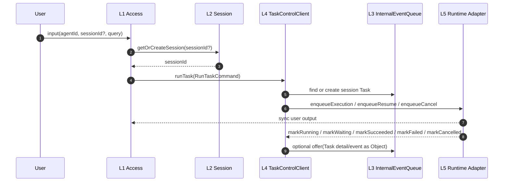
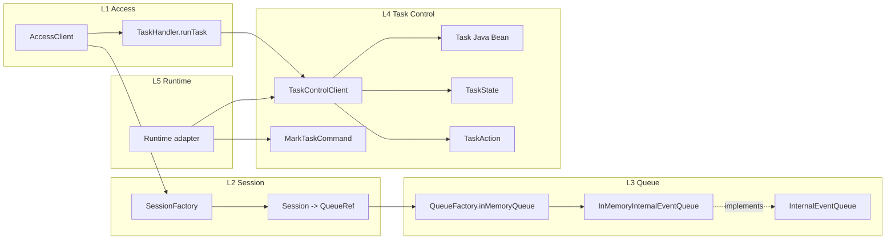
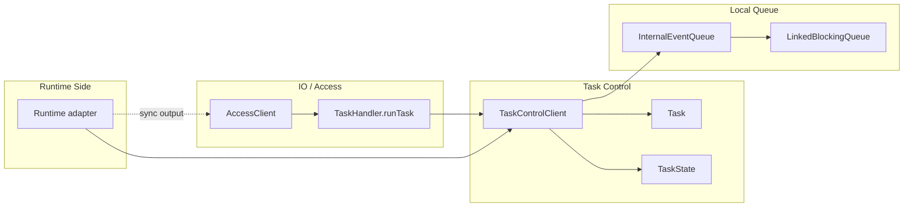
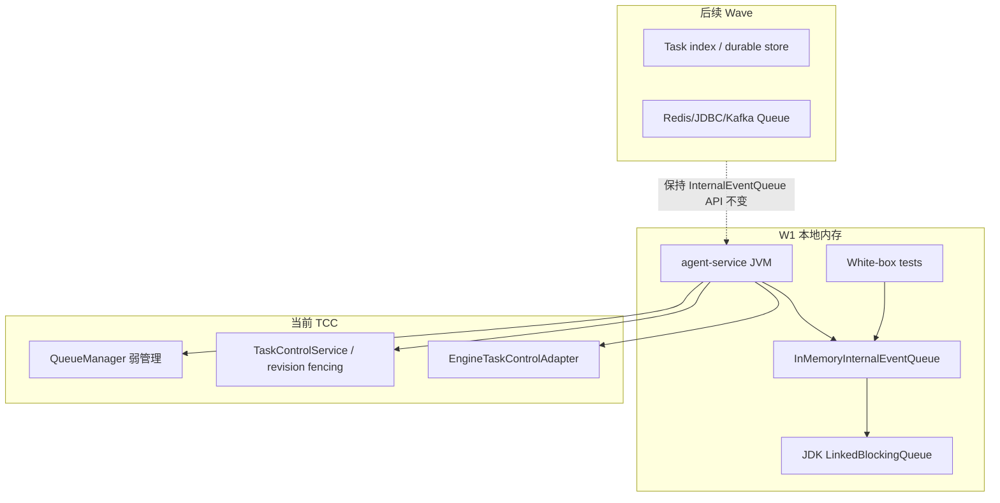
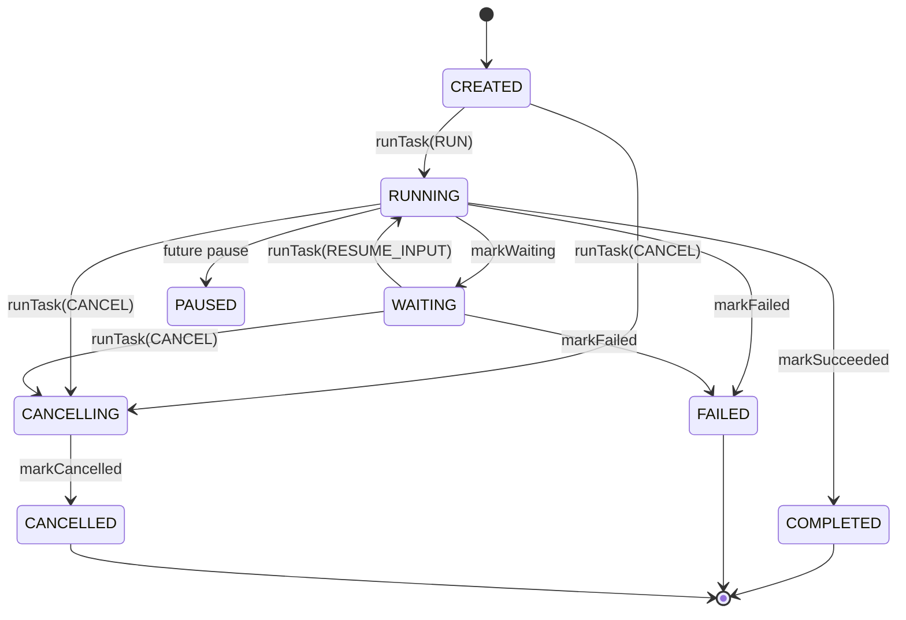

# Agent Service L3/L4 Taskflow Queue/Control 架构提议

本文收敛 2026-05-30 至 2026-06-01 的架构讨论，并同步当前 taskflow 实现。代码旁审阅入口见 `agent-service/src/main/java/com/huawei/ascend/service/taskcontrol/README.md`。

当前目标已经从“冻结最小接口面”推进到“本地可运行闭环”：IEQ 提供薄队列与弱管理，TCC 维护 Task 状态并通过 engine dispatch API 交付执行意图，runtime/engine 状态回写经 adapter 进入 TCC 裁决。

## 0. 结论

1. L3 是通用 Queue 层，不理解队列内容物类型。
2. L4 是 Task 控制层，拥有 Task、Task 状态、Task 动作和状态标记 API。
3. Session 不持有 Task；Session 可绑定 Queue/QueueRef，但只把 `sessionId` 返回给 Access。
4. L1 只通过一个 `runTask(RunTaskCommand)` 入口提交任务意图。
5. `RUN`、`RESUME_INPUT`、`CANCEL` 通过 `TaskAction` 枚举表达，不拆成多个 `TaskHandler` 方法。
6. `QueueFactory` 在 W1 是静态工厂类，不是 interface。
7. W1 Queue 使用 JDK `LinkedBlockingQueue` 实现内存 FIFO。
8. `QueueManager` 采用弱管理方向，当前已进入实现：记录队列注册、归属、查询和注销，不提供对外 admin port。
9. Runtime 不持有 Queue，不定义 `RuntimeQueueGateway`，不直接发布或消费 Queue。
10. Runtime 状态意图通过 `EngineTaskControlAdapter` 调用 L4 `TaskControlClient.mark*`。
11. Runtime 面向用户的主输出当前按同步返回路径进入 Access。
12. Task 信号在 L1-L4 内闭环：L1 归一输入，L2 只提供会话绑定，L3 只承载对象，L4 解释信号并维护 Task 状态。
13. `queued` 是处理过程，不是 Task 主状态。
14. `WAITING_FOR_TOOL` 与 `EXPIRED` 不进入 Task 主状态集合。
15. 外部请求携带 `agentId`，入口层负责非空、注册表/权限等合法性判断；TCC 信任入口契约，不理解 Agent 注册表，Runtime 只保留防御性兜底。

一句话版本：

```text
L1 用 runTask 提交意图，IEQ 提供薄 Queue 和弱管理，TCC 维护 Task 状态，runtime/engine 只通过 adapter 回写 mark* 状态意图。
```

## 0.1 本版实现增量

1. 新增代码旁说明：`agent-service/src/main/java/com/huawei/ascend/service/taskcontrol/README.md`。
2. IEQ 侧实现 `InternalEventQueue<T>`、`InMemoryInternalEventQueue<T>`、`QueueFactory`、`QueueManager`、`QueueRegistration`。
3. TCC 侧实现 `TaskControlService`：创建 Task、查找当前 Task、处理 `RUN` / `RESUME_INPUT` / `CANCEL`、执行状态流转、处理幂等键和 revision fencing。
4. Runtime/engine 桥接实现 `EngineTaskControlAdapter`：把 engine 回调映射到 TCC `markRunning`、`markWaiting`、`markSucceeded`、`markFailed`、`markCancelled`。
5. 自动配置实现 `TaskControlAutoConfiguration`，并在 engine 自动配置中补齐 `EngineDispatchApi`。
6. 白盒测试覆盖 Bean、队列、QueueManager、TCC 服务和 engine bridge。

## 0.2 与用户流程的关系

1. 系统启动时，Spring 创建 `QueueManager`、`TaskControlService`、`EngineTaskControlAdapter` 和 `EngineDispatchApi`。
2. Access 把协议输入转换成统一的 `AgentRequest(tenantId, userId, agentId, sessionId?, input, idempotencyKey, metadata)`。这个对象在 Access 阶段可以还没有 resolved `sessionId`。
3. `AccessSubmissionService` 是 Session 解析边界：它调用 `SessionManager.loadOrCreate(..., currentUserInput)`，创建或加载 Session，并把本次用户输入写入 `currentUserInput`；`currentUserInput` 只包含 `USER` 角色消息。
4. `AccessSubmissionService` 使用 resolved `sessionId` 重新构造 `AgentRequest`，再绑定 egress 并调用 `TaskControlClient.runTask(action=RUN)`。
5. TCC 只接收 resolved request；也就是说，进入 TaskControl 的 `sessionId` 必须非空。
6. TCC 根据 `tenantId + sessionId` 从 `QueueManager` 查找 session 队列；没有则通过 `QueueFactory.inMemorySessionQueue` 创建并注册。
7. TCC 在 session 队列内创建或选择 Task，然后通过 `EngineDispatchApi.enqueueExecution` 交给 runtime/engine。
8. Runtime/engine 需要等待用户时，经 `EngineTaskControlAdapter` 回写 `markWaiting`，TCC 把 Task 置为 `WAITING`。
9. 用户补充输入时，Access 再经 `AccessSubmissionService` 刷新 Session 的 `currentUserInput`，然后调用 `runTask(action=RESUME_INPUT)`；TCC 默认选择最新 `WAITING` Task 并调用 `enqueueResume`。
10. 用户取消时，Access 调用 `runTask(action=CANCEL)`，TCC 先置为 `CANCELLING`，再调用 `enqueueCancel`，最终由 adapter 回写 `markCancelled`。
11. Runtime/engine 面向用户的输出仍走同步返回到 Access 的链路；IEQ 不承担输出流。

### 0.3 AgentRequest 与 Session 解析边界

`AgentRequest` 是统一入参 DTO，不等同于“已经存在 Session 的请求”。当前约定如下：

1. 在 Access 协议转换阶段，`AgentRequest.sessionId` 可以为空；这表示客户端没有显式传入会话标识。
2. `AccessSubmissionService` 必须先调用 `SessionManager.loadOrCreate`，让 Session 层负责查找或创建会话。
3. `SessionManager` 返回 resolved `sessionId`，并只记录本次 `currentUserInput`；该字段只保存本次 `USER` 角色消息，Service 层不做 compact、budget 或完整上下文组装。
4. 只有 resolved `AgentRequest` 可以进入 TaskControl、Queue 和 Engine dispatch 相关路径。
5. 如果其它模块直接构造 `AgentRequest` 并绕过 `AccessSubmissionService` 调用 TaskControl，那么它必须自己保证 `sessionId` 已经 resolved；否则属于越过 Session-first 边界。

## 1. 与旧设计的冲突解决

| 冲突点 | 收敛结论 |
|---|---|
| Session 是否包含 Task | 不包含。Session 是会话窗口，不是任务聚合。 |
| Queue 是否持有 Task 状态 | 不持有。Queue 只管理对象顺序和读取，不解释对象。 |
| 是否需要三轨 Queue | 暂不需要。当前只保留薄 Queue API；通道语义由 TCC 和后续策略处理。 |
| Runtime 是否消费 Queue | 不消费。Runtime 不拿 Queue，也不发布 Queue 对象。 |
| 是否需要 `RuntimeQueueGateway` | 不需要。Runtime 细节先回到 L4，由 L4 决定是否写 Queue。 |
| `TaskHandler` 是否需要多个方法 | W1 不需要。统一 `runTask + TaskAction`。 |
| `QueueFactory` 是否是 SPI/interface | W1 不是。当前为静态工厂函数。 |
| taskflow 是否新增 SPI 包 | W1 不新增。当前是内部 API 与本地组件。 |

## 2. 4+1 视图

### 2.1 场景视图



说明：

- Access 不需要知道 `queueId`。
- TCC 通过 `sessionId` 和 `QueueManager` 找到 session 队列。
- Runtime 同步返回用户输出，同时通过 adapter 回写状态意图。
- Queue 只看到 `Object`，不知道对象是否代表 Task、上下文或诊断信息。

### 2.2 逻辑视图



### 2.3 开发视图

```text
agent-service/src/main/java/com/huawei/ascend/service/
  queue/
    InternalEventQueue.java
    InMemoryInternalEventQueue.java
    QueueFactory.java
    QueueManager.java
    QueueRegistration.java

  control/
    Task.java
    TaskState.java
    TaskFailureCode.java
    WaitingReason.java
    TaskControlService.java
    EngineTaskControlAdapter.java
    api/
      TaskControlClient.java

agent-service/src/test/java/com/huawei/ascend/service/taskcontrol/test/
  TaskBeanWhiteboxTest.java
  InMemoryInternalEventQueueWhiteboxTest.java
  TaskControlClientApiWhiteboxTest.java
  QueueManagerWhiteboxTest.java
  TaskControlServiceWhiteboxTest.java
  TaskflowEngineBridgeWhiteboxTest.java
```

开发约束：

1. `queue/` 不依赖 `control/`、`access/`、`session/`、Runtime。
2. `control/api/TaskControlClient` 是内部 API，不是 SPI。
3. 当前不新增 `spi/` 包。
4. Runtime adapter 不放进 `queue/`。
5. 当前通过 `EngineTaskControlAdapter` 对接 Runtime/Engine 状态回写，IEQ 不感知。

### 2.4 进程视图



### 2.5 物理视图



## 3. 接口定义

### 3.1 InternalEventQueue

```java
public interface InternalEventQueue<T> {
    String queueId();
    boolean offer(T value);
    Optional<T> poll();
    Optional<T> peek();
    Optional<T> find(Predicate<? super T> matcher);
    List<T> snapshot();
    int size();
}
```

### 3.2 QueueFactory

```java
public final class QueueFactory {
    private QueueFactory() {
    }

    public static <T> InternalEventQueue<T> inMemoryQueue(String queueId) {
        return new InMemoryInternalEventQueue<>(queueId);
    }

    public static <T> InternalEventQueue<T> inMemoryQueue(
            String queueId, QueueManager manager, QueueRegistration registration) {
        return manager.register(new InMemoryInternalEventQueue<>(queueId), registration);
    }

    public static InternalEventQueue<Task> inMemorySessionQueue(
            String tenantId, String sessionId, QueueManager manager) {
        QueueRegistration registration = QueueRegistration.session(tenantId, sessionId);
        return inMemoryQueue(registration.queueId(), manager, registration);
    }
}
```

### 3.3 QueueManager

```java
public class QueueManager {
    public <T> InternalEventQueue<T> register(InternalEventQueue<T> queue, QueueRegistration registration);
    public Optional<InternalEventQueue<?>> findByQueueId(String queueId);
    public Optional<InternalEventQueue<?>> findBySession(String tenantId, String sessionId);
    public Optional<QueueRegistration> registration(String queueId);
    public List<QueueRegistration> registrations();
    public void unregister(String queueId);
}
```

### 3.4 TaskControlClient

```java
public interface TaskControlClient {
    CompletionStage<TaskResult> runTask(RunTaskCommand command);

    CompletionStage<TaskResult> markRunning(MarkTaskCommand command);
    CompletionStage<TaskResult> markWaiting(MarkTaskCommand command);
    CompletionStage<TaskResult> markSucceeded(MarkTaskCommand command);
    CompletionStage<TaskResult> markFailed(MarkTaskCommand command);
    CompletionStage<TaskResult> markCancelled(MarkTaskCommand command);
}
```

动作枚举：

```java
public enum TaskAction {
    RUN,
    RESUME_INPUT,
    CANCEL
}
```

## 4. Task 状态



状态集合：

```text
CREATED
RUNNING
WAITING
PAUSED
CANCELLING
COMPLETED
FAILED
CANCELLED
```

排除项：

- `QUEUED`：这是入队过程，不是 Task 状态。
- `WAITING_FOR_TOOL`：工具等待用 detail/reason 表达。
- `EXPIRED`：过期用失败码或 Runtime detail 表达。

## 5. 开闭原则与依赖倒置

### 5.1 开闭原则

| 扩展点 | 允许方式 | 不允许方式 |
|---|---|---|
| Queue backend | 新增实现类，例如 Redis/JDBC/Kafka Queue。 | 修改 `TaskControlClient` 或让 Queue 理解 Task。 |
| Task 动作 | 优先扩展 `TaskAction`。 | 给 `TaskHandler` 继续加多个入口方法。 |
| Runtime 接入 | Runtime 侧 adapter 调用 `TaskControlClient.mark*`。 | Runtime 直接持有 Queue 或写 Task 字段。 |
| Queue 管理 | 当前实现弱管理 `QueueManager`。 | 把 admin port 挂到 `InternalEventQueue` 主接口。 |
| Task 查询 | 当前由 TCC 基于 session 队列查找；后续可增加索引。 | 让 IEQ 理解 Task 状态。 |

### 5.2 依赖倒置

依赖方向：

```text
L1 Access -> L4 TaskControlClient
L4 Control -> L3 InternalEventQueue
L3 Queue -> JDK only
Runtime adapter -> L4 TaskControlClient.mark*
```

硬约束：

1. `queue/` 不依赖 `control/`。
2. `control/` 不依赖具体 Runtime。
3. Runtime 不依赖完整 Queue。
4. Access 不感知 `queueId`。
5. 后续管理能力通过新组件接入，不污染 W1 主接口。

## 6. QueueManager 裁决

当前结论：采用弱管理方向，并已实现 `QueueManager`。

弱管理含义：

1. Queue 创建仍通过 factory。
2. Manager 记录 Queue 创建事实、归属、销毁事实和监听关系。
3. Manager 不作为唯一强制创建入口。
4. Manager 不要求普通调用方拿 admin port。
5. Manager 不理解 Task 状态。

当前实现：

```text
QueueFactory.inMemorySessionQueue -> QueueManager.register
QueueManager.findBySession -> locate session queue
QueueManager.unregister -> remove queue registration
```

## 7. Runtime 边界

当前不定义：

- `RuntimeQueueGateway`
- Runtime Queue consumer
- Runtime Queue publisher
- 第二套 Runtime 侧 `TaskControlClient`

当前定义：

1. Runtime 可以同步返回面向用户的输出。
2. Runtime 可以通过 adapter 调用 L4 `markRunning`、`markWaiting`、`markSucceeded`、`markFailed`、`markCancelled`。
3. Runtime 如果产生 checkpoint、诊断、压缩上下文，先作为 detail/result 交给 L4。
4. L4 决定是否把这些对象写入 Queue。

## 8. 用户首次多轮流程

```mermaid
sequenceDiagram
    autonumber
    participant Boot as System Boot
    participant Access as Access
    participant Session as SessionFactory
    participant Queue as QueueFactory
    participant TCC as TaskControlClient
    participant Runtime as Runtime Adapter

    Boot->>Access: register TaskHandler
    Access->>Session: getOrCreateSession(input.sessionId)
    Session->>Queue: inMemoryQueue(sessionQueueId)
    Session-->>Access: sessionId
    Access->>TCC: runTask(action=RUN, sessionId, agentId, input)
    TCC->>TCC: create Task(CREATED)
    TCC->>Runtime: enqueueExecution
    Runtime-->>TCC: markRunning
    Runtime-->>Access: sync output
    Runtime-->>TCC: markWaiting(USER_INPUT)
    Access->>TCC: runTask(action=RESUME_INPUT, sessionId, input)
    TCC->>Runtime: enqueueResume with existing task
    Runtime-->>TCC: markFailed(OUT_OF_DOMAIN)
    TCC->>TCC: mark failed; next-task policy remains future wave
```

流程备注：

- 第一次没有 Session 时，由 SessionFactory 创建 Session。
- Session 对 Access 只返回 `sessionId`。
- Access 不传 `queueId`。
- 有效 Task 的判断当前由 TCC 在 session 队列内完成；后续可增加索引或持久化 TaskStore。
- OOD 后是否立即创建新 Task 是后续 W3 策略，需要单独实现和测试。

## 9. 风险与待确认

| 风险 | 当前处理 |
|---|---|
| Runtime 同步返回 Access，同时回写 TCC，可能出现顺序/失败一致性问题。 | 记录为 W3/W4 风险；需要幂等键、revision 和失败补偿策略。 |
| Access 不知道 `queueId`，TCC 如何定位 Queue。 | 通过 `QueueManager.findBySession(tenantId, sessionId)` 解决。 |
| OOD 后谁创建新 Task。 | L4 创建，Runtime 只报告 `OUT_OF_DOMAIN` / `NOT_CURRENT_TASK`。 |
| QueueManager 强管理会带来权限面。 | 采用弱管理，不暴露 admin port。 |
| 当前 API 仍有 `mark*` 多方法。 | 这些是 Runtime adapter 回写状态意图，不是 L1 handler 入口；L1 仍只有 `runTask`。 |
| `agentId` 如果完全放到 Runtime 校验，会导致晚失败。 | 入口层先做非空、注册表/权限等合法性判断；TCC 只信任契约并透传，Runtime 仅兜底返回 `AGENT_ID_INVALID`。 |

## 10. Wave 计划

### W1：当前实现

交付：

- `InternalEventQueue`
- `InMemoryInternalEventQueue`
- `QueueFactory`
- `Task`
- `TaskState`
- `TaskFailureCode`
- `WaitingReason`
- `TaskControlClient`
- `QueueManager`
- `QueueRegistration`
- `TaskControlService`
- `EngineTaskControlAdapter`
- 白盒测试

验证：

- Queue FIFO。
- Queue snapshot 只读且不 drain。
- Task Java Bean 可设置状态。
- Task transition 递增 revision。
- `RunTaskCommand` 防御性拷贝 metadata。
- `CANCEL` 必须携带 `taskId`。
- `QueueManager` 可按 `queueId` 与 session 查询。
- `TaskControlService` 能创建、恢复、取消和标记 Task。
- `EngineTaskControlAdapter` 能把 engine 回调映射成 TCC 状态流转。

### W2：Access / Session 集成

交付：

- Access 注册绑定 TCC 的 TaskHandler。
- Session 创建时明确绑定 session 队列。
- Access 只透传 `sessionId` 和 `agentId`，不感知 `queueId`。
- 端到端跑通首次输入、等待补充和取消任务。

### W3：状态策略增强

交付：

- OOD 后由 TCC 创建新 Task 的策略。
- 并发输入排序策略测试。
- dispatch 失败补偿策略。
- 独立 Task 索引或持久化 TaskStore 评估。

### W4：持久化 IEQ 后端

交付：

- Redis/JDBC/Kafka 等队列实现。
- 保持 `InternalEventQueue` 语义不变。
- 保持 Queue 不理解 Task 状态。
- 补充 at-least-once / exactly-once 边界说明。

## 11. 当前 PR 检查项

必须满足：

1. Java 代码里没有 `RuntimeQueueGateway`。
2. Java 代码里没有 `resumeInput(...)` / `cancelTask(...)` handler 方法。
3. `TaskControlClient` 只有一个 L1 入站入口 `runTask(...)`。
4. `TaskAction` 包含 `RUN`、`RESUME_INPUT`、`CANCEL`。
5. `QueueFactory` 是 `final` 类，提供静态 `inMemoryQueue(...)`。
6. 白盒测试在 `agent-service/src/test/java/com/huawei/ascend/service/taskcontrol/test`。
7. 文档位于 `architecture/docs/L1/agent-service/`。
