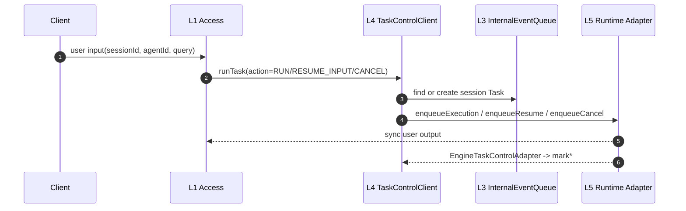
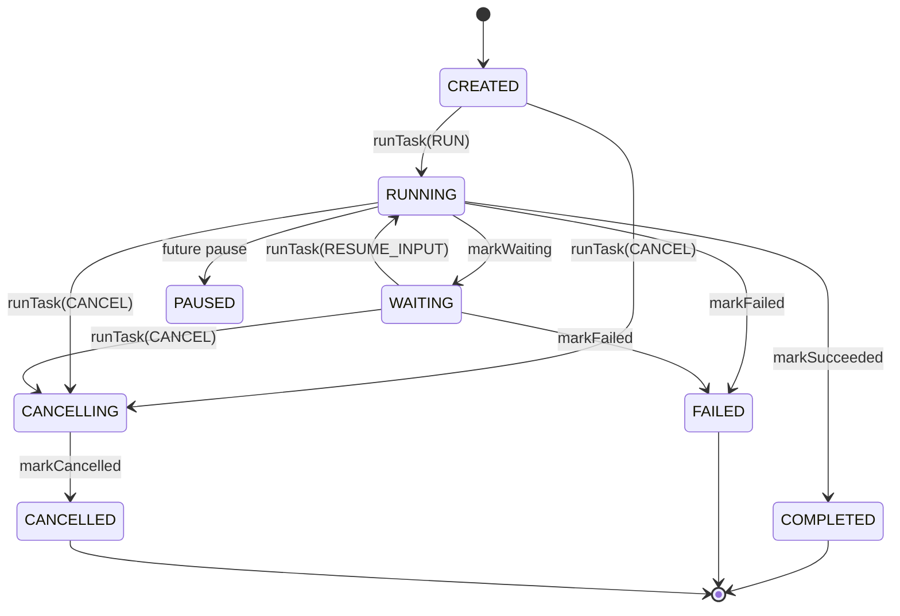

# Agent Service IEQ / Task-Control 实现规格

本文说明当前 IEQ / Task-Control 的实现形态：包结构、接口、数据结构、测试和后续 Wave。本文不重复解释为什么这样设计；原因见同目录架构提议文档。

代码旁审阅入口见：

```text
agent-service/src/main/java/com/huawei/ascend/service/taskcontrol/README.md
```

## 0. W1 实现范围

W1 已经从“接口冻结”推进到“本地可运行闭环”：

1. L3 提供一个基于 JDK `LinkedBlockingQueue` 的本地内存队列。
2. `QueueFactory` 是 `final` 工具类，提供静态工厂函数，不是 interface。
3. L4 提供 `Task` Java Bean、Task 状态枚举、失败码、等待原因。
4. L4 提供一个紧凑的 `TaskControlClient` API。
5. L1 侧只有一个任务入口：`runTask(RunTaskCommand)`。
6. `RUN`、`RESUME_INPUT`、`CANCEL` 通过 `TaskAction` 表达，不拆成多个 handler 方法。
7. 当前实现 `QueueManager` 弱管理：记录队列注册、按 `queueId` 查询、按 `tenantId + sessionId` 查询和注销。
8. 当前不定义 `RuntimeQueueGateway`。Runtime 不直接发布或消费 Queue。
9. 当前实现 `TaskControlService`，负责 Task 创建、当前 Task 选择、状态流转、幂等和 revision fencing。
10. 当前实现 `EngineTaskControlAdapter`，把 engine 侧状态回调转成 TCC `mark*` 调用。

## 1. 包结构

```text
agent-service/src/main/java/com/huawei/ascend/service/
  queue/
    InternalEventQueue.java
    InMemoryInternalEventQueue.java
    QueueFactory.java
    QueueManager.java
    QueueRegistration.java

  control/
    Task.java
    TaskState.java
    TaskFailureCode.java
    WaitingReason.java
    TaskControlService.java
    EngineTaskControlAdapter.java
    api/
      TaskControlClient.java

agent-service/src/test/java/com/huawei/ascend/service/taskcontrol/test/
  TaskBeanWhiteboxTest.java
  InMemoryInternalEventQueueWhiteboxTest.java
  TaskControlClientApiWhiteboxTest.java
  QueueManagerWhiteboxTest.java
  TaskControlServiceWhiteboxTest.java
  TaskflowEngineBridgeWhiteboxTest.java
```

命名规则：

- `api/` 表示平台内部调用 API。
- 当前没有新增 `spi/` 包；SPI 只用于“本模块定义接口、外部 provider 实现”的扩展点。
- `TaskControlClient` 当前由 L4 拥有，不要求外部 provider 实现，因此不放在 `spi/`。

## 2. L3 Queue 接口

### 2.1 InternalEventQueue

```java
package com.huawei.ascend.service.queue;

import java.util.List;
import java.util.Optional;
import java.util.function.Predicate;

public interface InternalEventQueue<T> {
    String queueId();
    boolean offer(T value);
    Optional<T> poll();
    Optional<T> peek();
    Optional<T> find(Predicate<? super T> matcher);
    List<T> snapshot();
    int size();
}
```

实现规则：

1. Queue 不关心队列内容物类型。
2. Queue 不解析 Task，不持有 Task 状态。
3. Queue 当前只提供 FIFO、查看快照、按谓词查找和读取能力。
4. `snapshot()` 返回只读拷贝，不能 drain 队列。
5. Queue 不暴露 admin port。

### 2.2 InMemoryInternalEventQueue

```java
public final class InMemoryInternalEventQueue<T> implements InternalEventQueue<T> {
    // 使用 JDK LinkedBlockingQueue 作为 W1 本地内存实现。
}
```

实现规则：

1. `queueId` 必须非空白。
2. `offer(null)` 必须拒绝。
3. FIFO 顺序以 JDK 队列语义为准。
4. 该实现仅用于 W1 本地验证；后续 Redis/JDBC/Kafka 等实现不得改变 `InternalEventQueue` 基础语义。

### 2.3 QueueFactory

```java
public final class QueueFactory {
    private QueueFactory() {
    }

    public static <T> InternalEventQueue<T> inMemoryQueue(String queueId) {
        return new InMemoryInternalEventQueue<>(queueId);
    }

    public static <T> InternalEventQueue<T> inMemoryQueue(
            String queueId, QueueManager manager, QueueRegistration registration) {
        return manager.register(new InMemoryInternalEventQueue<>(queueId), registration);
    }

    public static InternalEventQueue<Task> inMemorySessionQueue(
            String tenantId, String sessionId, QueueManager manager) {
        QueueRegistration registration = QueueRegistration.session(tenantId, sessionId);
        return inMemoryQueue(registration.queueId(), manager, registration);
    }
}
```

实现规则：

1. `QueueFactory` 不是 interface。
2. W1 只提供静态工厂函数。
3. 带 `QueueManager` 的重载在创建 session 队列时同步注册弱管理关系。
4. 创建 Queue 不要求调用方知道具体实现类。

### 2.4 QueueManager

`QueueManager` 是弱管理对象，不是 admin port。

```java
public class QueueManager {
    public <T> InternalEventQueue<T> register(InternalEventQueue<T> queue, QueueRegistration registration);
    public Optional<InternalEventQueue<?>> findByQueueId(String queueId);
    public Optional<InternalEventQueue<?>> findBySession(String tenantId, String sessionId);
    public Optional<QueueRegistration> registration(String queueId);
    public List<QueueRegistration> registrations();
    public void unregister(String queueId);
}
```

实现规则：

1. `QueueManager` 只记录队列注册、归属和注销事实。
2. `QueueManager` 不理解 Task 状态。
3. 普通调用方不需要拿到对外 admin port。
4. session 队列通过 `tenantId + sessionId` 定位，Access 不传 `queueId`。

## 3. L4 Task 数据结构

### 3.1 Task

`Task` 是 Java Bean，有默认构造函数、setter/getter 和一个便捷工厂函数。

关键字段：

```text
tenantId
sessionId
taskId
agentId
state
revision
waitingReason
failureCode
detail
createdAt
updatedAt
```

实现规则：

1. `tenantId`、`sessionId`、`taskId`、`state`、`revision`、`createdAt`、`updatedAt` 必须有效。
2. `agentId` 来自入口层已校验的请求；TCC 不理解 Agent 注册表，只按契约保存和透传。
3. `transitionTo(...)` 修改状态并递增 `revision`。
4. `terminal()` 判断 `COMPLETED`、`FAILED`、`CANCELLED`。

### 3.2 TaskState

```java
public enum TaskState {
    CREATED,
    RUNNING,
    WAITING,
    PAUSED,
    CANCELLING,
    COMPLETED,
    FAILED,
    CANCELLED
}
```

实现规则：

1. `QUEUED` 不是 Task 状态；入队只是处理过程。
2. `WAITING_FOR_TOOL` 不进入主状态集合；工具等待由 Runtime detail 或失败原因表达。
3. `EXPIRED` 不进入主状态集合；过期由 Runtime 返回失败原因表达。

### 3.3 TaskFailureCode

```java
public enum TaskFailureCode {
    AGENT_ID_INVALID,
    OUT_OF_DOMAIN,
    NOT_CURRENT_TASK,
    ENGINE_DISPATCH_REJECTED,
    RUNTIME_ERROR,
    CANCELLED_BY_RUNTIME
}
```

说明：

- `OUT_OF_DOMAIN` / `NOT_CURRENT_TASK` 用于表达 Runtime 认为输入不属于当前 Task。
- 是否创建新 Task 由 L4 后续控制实现决定。

### 3.4 WaitingReason

```java
public enum WaitingReason {
    USER_INPUT,
    USER_CONFIRMATION,
    DEPENDENCY
}
```

## 4. L4 TaskControlClient API

`TaskControlClient` 是 L4 对 L1 和 Runtime adapter 暴露的内部 API。

```java
public interface TaskControlClient {
    CompletionStage<TaskResult> runTask(RunTaskCommand command);

    CompletionStage<TaskResult> markRunning(MarkTaskCommand command);
    CompletionStage<TaskResult> markWaiting(MarkTaskCommand command);
    CompletionStage<TaskResult> markSucceeded(MarkTaskCommand command);
    CompletionStage<TaskResult> markFailed(MarkTaskCommand command);
    CompletionStage<TaskResult> markCancelled(MarkTaskCommand command);
}
```

### 4.1 TaskAction

```java
public enum TaskAction {
    RUN,
    RESUME_INPUT,
    CANCEL
}
```

规则：

1. L1 只调用 `runTask`。
2. 首次用户输入使用 `TaskAction.RUN`。
3. 用户补充等待中的 Task 使用 `TaskAction.RESUME_INPUT`。
4. 用户取消使用 `TaskAction.CANCEL`。
5. 后续需要更多动作时扩展 `TaskAction`，不优先增加新的 handler 方法。

### 4.2 RunTaskCommand

```java
public record RunTaskCommand(
        String tenantId,
        String sessionId,
        String taskId,
        String agentId,
        TaskAction action,
        Object input,
        String reason,
        String idempotencyKey,
        Map<String, Object> metadata) {
}
```

校验规则：

1. `tenantId`、`sessionId`、`action` 必须存在。
2. `CANCEL` 必须携带 `taskId`。
3. 非 `CANCEL` 动作必须携带 `input`。
4. `metadata` 防御性拷贝。
5. `agentId` 由入口层完成非空、注册表/权限等合法性判断；TCC 不重复理解 Agent 合法性，只信任契约并透传。

### 4.3 MarkTaskCommand

```java
public record MarkTaskCommand(
        String tenantId,
        String sessionId,
        String taskId,
        long expectedRevision,
        WaitingReason waitingReason,
        TaskFailureCode failureCode,
        Object detail,
        Map<String, Object> metadata) {
}
```

校验规则：

1. `tenantId`、`sessionId`、`taskId` 必须存在。
2. `expectedRevision` 必须为正数。
3. `metadata` 防御性拷贝。
4. Runtime adapter 通过 `mark*` 提交状态意图，真实状态流转由 L4 控制实现裁决。

### 4.4 TaskResult

```java
public record TaskResult(
        String tenantId,
        String sessionId,
        String taskId,
        TaskState state,
        long revision,
        boolean accepted,
        String message) {
}
```

## 5. Runtime / engine 边界

当前不定义 `RuntimeQueueGateway`，但已经通过 PR #100/#105 的 engine dispatch API 完成最小桥接。

规则：

1. Runtime 不持有 `InternalEventQueue`。
2. Runtime 不实现 `RuntimeQueueGateway`。
3. Runtime 不直接发布或消费 Queue。
4. Runtime 面向 Access 的输出按同步返回链路处理。
5. Runtime 的状态意图由 adapter 转成 `TaskControlClient.mark*` 调用。
6. Runtime 细节对象如果需要入队，必须先交回 L4，由 L4 决定是否写 Queue。
7. TCC 通过 `EngineDispatchApi.enqueueExecution`、`enqueueResume`、`enqueueCancel` 把执行意图交给 engine/runtime 侧。
8. `EngineTaskControlAdapter` 把 engine 侧 Task 控制回调映射到 `TaskControlService.mark*`。

## 6. 当前流程视图



## 7. 状态转换视图



## 8. 白盒测试

W1 测试目录：

```text
agent-service/src/test/java/com/huawei/ascend/service/taskcontrol/test/
```

当前测试：

1. `QueueManagerWhiteboxTest`
2. `TaskControlServiceWhiteboxTest`
3. `TaskflowEngineBridgeWhiteboxTest`

最小验证命令：

```bash
./mvnw -pl agent-service -am \
  -Dtest=QueueManagerWhiteboxTest,TaskControlServiceWhiteboxTest,TaskflowEngineBridgeWhiteboxTest \
  -Dsurefire.failIfNoSpecifiedTests=false \
  -Pquality -B -ntp test
```

## 9. 后续 Wave

### W2：Access / Session 集成

目标：

- Access 注册绑定 TCC 的 TaskHandler。
- Session 创建时明确绑定 session 队列。
- Access 仍只传 `sessionId`，不感知 `queueId`。
- 端到端串起首次用户输入、等待用户补充和取消任务。

### W3：状态策略增强

目标：

- 明确 Runtime OOD 后由 TCC 创建新 Task 的策略。
- 补充并发用户输入的排序策略测试。
- 补充 dispatch 失败后的补偿策略。
- 评估是否需要独立 Task 索引或持久化 TaskStore。

### W4：持久化 IEQ 后端

目标：

- 增加 Redis/JDBC/Kafka 等后端实现。
- 保持 `InternalEventQueue` 语义不变。
- 保持 Queue 不理解 Task 状态。
- 为持久化后端补充 exactly-once / at-least-once 边界说明。

## 10. 已解决的冲突

1. `TaskHandler` 不再暴露 `resumeInput`、`cancelTask`，统一为 `runTask + TaskAction`。
2. `QueueFactory` 不再是 interface，W1 是静态工具类。
3. 当前实现 `QueueManager` 弱管理，不实现强管理或对外 admin port。
4. 当前不定义 `RuntimeQueueGateway`。
5. IEQ / Task-Control 当前按内部 API 处理，不注册为新的 SPI 面。
6. 白盒测试已经放入 `agent-service/src/test/java/com/huawei/ascend/service/taskcontrol/test`。
