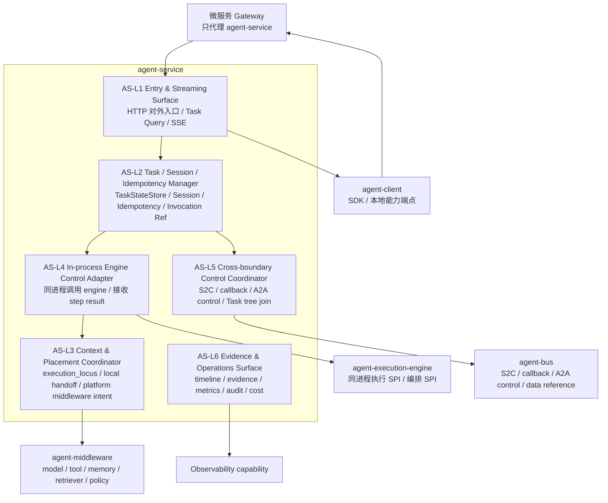
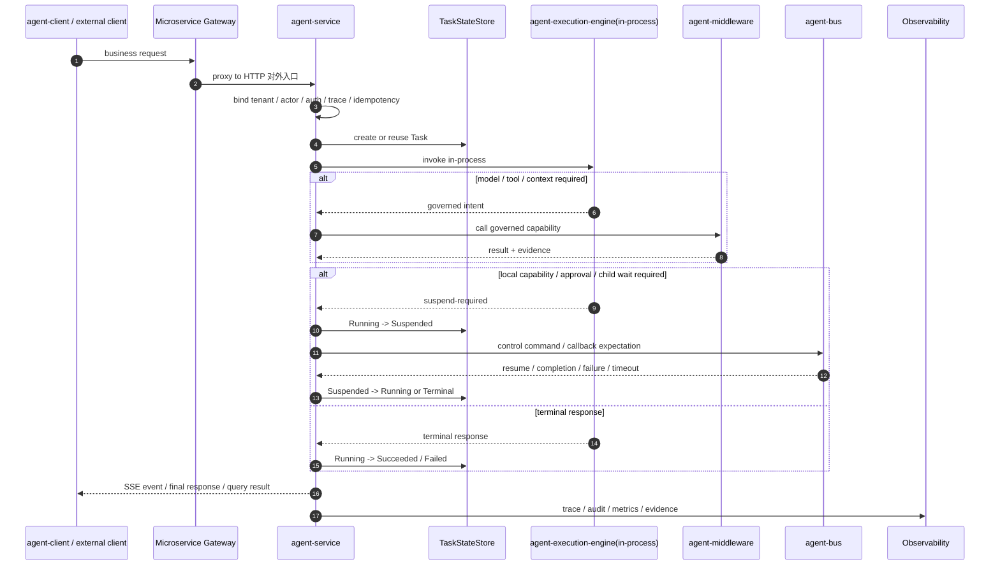
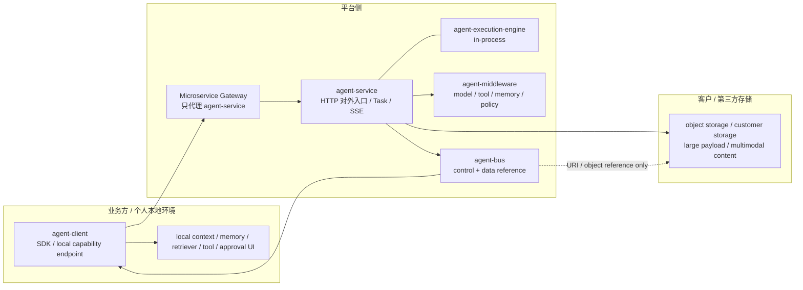

# Agent Service 4+1 View

## 目的

用 4+1 视图组织 `agent-service` 的详细设计，使模块负责人、AI agent、harness 生成器和评审者可以快速知道：

- `agent-service` 由哪些内部职责层组成；
- Task、Session、Task Tree、SSE、Evidence 等状态和事件由谁拥有；
- 一次请求、一次 step、一次 suspend/resume、一次 A2A 协作如何流动；
- 代码包、开发切片和 harness 如何落到实现；
- 哪些场景驱动了这些设计。

本文是导航型详细视图：保留关键图、关键约束和阅读路径，细节正文分别落在 `logical-design.md`、`state-model.md`、`process-design.md`、`development-view.md`、`development-slices.md` 和 `harness-design.md`。

## 维护规则

- 本文不复制所有细节，但每个结论必须能跳转到详细设计文件。
- 如果本文与详细设计文件冲突，以详细设计文件为待修复源，不能沉默保留冲突。
- 本文中的 `Run` 只能作为历史实现兼容或 client invocation 兼容表达；服务端 canonical 状态是 Task。
- 本文不得把 Gateway、Bus、Context Engine、Tool Gateway 写成 `agent-service` 内部模块。
- 本文不得把 `agent-execution-engine` 写成默认远程服务；当前目标运行形态是与 `agent-service` 同进程组合。

## +1 驱动场景

4 个视图不是凭空拆出来的，它们被下面的业务活动和技术子场景驱动。

| 场景 | 对 `agent-service` 的设计压力 | 主要涉及视图 |
|---|---|---|
| BA-001 Agent Handles Business Request | 应用开发者需要创建 Task、调试执行路径、观察指标、消费 SSE 实时输出。 | Logical, Process, Development, Scenarios |
| BA-002 Human Approval Tool Call | 高风险工具需要 suspend/resume、审批回调、审计和重复回调保护。 | Process, Logical, Scenarios |
| BA-003 Multi-Agent Delegation | 同 service 多 Agent 协作由 service 闭环；跨边界 A2A 通过 Bus 控制指令。 | Logical, Process, Physical, Scenarios |
| S1 Create Task / Invocation | 入口、幂等、Task 初始状态、client invocation reference。 | Process, State, Harness |
| S2 Execute Agent Step | service 同进程调用 engine，engine 不写 Task State。 | Logical, Process, Development |
| S5 Suspend / Resume | 长等待、S2C、本地能力、审批、child Task 等待都不能占用线程。 | Process, State, Harness |
| S6 Child Task / Federation | Task tree、same-service join、Bus control、data reference。 | Logical, Physical, Process |

## 1. Logical View

### 视图回答的问题

`agent-service` 内部由哪些职责层组成？每层拥有和不拥有的东西是什么？它如何与 engine、middleware、bus、client 和 observability 协作？

### 关键结构



### 核心结论

| 结论 | 说明 | 详细位置 |
|---|---|---|
| `agent-service` 是 Task lifecycle owner。 | 所有服务端执行状态写入都通过 `agent-service` controlled transition path。 | [logical-design.md](logical-design.md), [state-model.md](state-model.md) |
| `agent-service` 与 `agent-execution-engine` 同进程组合。 | service 管入口和状态，engine 管执行 SPI；engine 不作为默认远程服务。 | [logical-design.md](logical-design.md), [process-design.md](process-design.md) |
| Gateway 不是 service 内部层。 | Gateway 是微服务入口能力，只代理 `agent-service`。 | [logical-design.md](logical-design.md), [development-view.md](development-view.md) |
| Bus 不是 payload / token stream 通道。 | Bus 只传 S2C、callback、A2A control 和 data reference envelope。 | [logical-design.md](logical-design.md), [process-design.md](process-design.md) |
| SSE 归 `agent-service` 对外实时输出。 | SSE stream event 不写 Task State。 | [process-design.md](process-design.md), [harness-design.md](harness-design.md) |

## 2. Process View

### 视图回答的问题

一次请求如何变成 Task？Task 如何执行 step？何时 suspend/resume？同 service 多 Agent 和跨边界 A2A 如何区别？实时输出如何走 SSE？

### 主流程总览



### 流程清单

| Process | 关键点 | 详细位置 |
|---|---|---|
| P1 标准业务请求进入并创建 Task | Gateway 代理到 service；幂等创建或复用 Task。 | [process-design.md](process-design.md#p1-标准业务请求进入并创建-task) |
| P2 同进程执行 Agent step | service 同进程调用 engine；engine 返回 intent/result。 | [process-design.md](process-design.md#p2-同进程执行-agent-step) |
| P3 suspend / resume | 本地能力、审批、business service、child Task 等待统一表达为 suspend/resume。 | [process-design.md](process-design.md#p3-suspend--resume) |
| P4 同一 service 内多 Agent | service 创建 child Task、等待、join，不经过 Bus。 | [process-design.md](process-design.md#p4-同一-service-内多-agent-child-task--join) |
| P5 跨边界 A2A | 通过 Bus 传控制指令和 data reference，不传大型 payload。 | [process-design.md](process-design.md#p5-跨边界-a2a-控制指令和-data-reference) |
| P6 SSE 实时输出 | service 发布 SSE event，不写 Task State。 | [process-design.md](process-design.md#p6-sse-实时输出) |
| P7 cancel / terminal 竞争 | atomic transition 只有一个获胜写入。 | [process-design.md](process-design.md#p7-cancel--terminal-竞争处理) |

## 3. Development View

### 视图回答的问题

代码应该怎么组织？哪些包属于入口、状态、engine adapter、placement、S2C、evidence？新增代码应该落在哪个切片？哪些依赖是禁止的？

### 包结构视图

```text
agent-service/src/main/java/com/huawei/ascend/service
├── platform/              # HTTP 对外入口、tenant/auth/idempotency/trace/SSE 相关基础设施
├── task/                  # Task aggregate / TaskStateStore SPI
├── session/               # Session shell / ContextProjector SPI
├── runtime/runs/          # 历史 Run 兼容实现区，不恢复为新 owner
├── runtime/idempotency/   # IdempotencyRecord
├── runtime/s2c/           # S2C service-side binding
├── engine/                # service-side engine adapter surface
├── orchestrator/          # service-side orchestration coordinator
├── integration/springai/  # Spring AI reference adapter / 下沉实现约束
└── agent/spi/             # Agent / AgentRegistry draft
```

### 开发切片

| Slice | 目标 | 先后关系 |
|---|---|---|
| AS-SLICE-001 Entry Context & Trace Binding | HTTP 对外入口绑定 tenant / actor / trace。 | 第一批 |
| AS-SLICE-002 Task Creation & Idempotency | 创建 / 复用 Task。 | 第一批 |
| AS-SLICE-003 Task Controlled Transition | 状态转换受控、terminal idempotency、cancel race。 | 第一批 |
| AS-SLICE-004 In-process Engine Dispatch | 同进程调用 engine。 | 第一批 |
| AS-SLICE-005 Context / Tool Placement Coordinator | platform middleware / local client / business service handoff。 | 第二批 |
| AS-SLICE-006 Suspend / Resume Coordinator | S2C、approval、business service、child Task resume。 | 第二批 |
| AS-SLICE-007 Task Tree & Same-service Multi-Agent Join | 同 service child Task 和 join。 | 第二批 |
| AS-SLICE-008 Cross-boundary A2A Control | Bus control + data reference。 | 第三批 |
| AS-SLICE-009 Service SSE Stream | 对外 SSE 实时输出。 | 第二批 |
| AS-SLICE-010 Developer Evidence Query | Task timeline 和 decision evidence。 | 第二批 |
| AS-SLICE-011 Runtime Metrics / Audit / Cost Attribution | 运维指标、审计、LLM 成本归集。 | 第一批 / 横切 |
| AS-SLICE-012 Replay-safe Fixture Export | 失败 Task 脱敏回放。 | 第三批 |

### 关键依赖规则

| Rule | 约束 | 详细位置 |
|---|---|---|
| DEV-R-001 | `runtime.*` 不得依赖 `platform.*` ThreadLocal tenant。 | [development-view.md](development-view.md) |
| DEV-R-002 | engine adapter 不得直接写 Task State。 | [development-view.md](development-view.md) |
| DEV-R-003 | `runtime.runs` 只作历史兼容实现区。 | [development-view.md](development-view.md), [state-model.md](state-model.md) |
| DEV-R-004 | `runtime.s2c` 不承载大型 payload 或逐 token stream。 | [development-view.md](development-view.md) |
| DEV-R-006 | 新增子包必须归入 AS-L1..AS-L6 或 cross-cutting。 | [development-view.md](development-view.md) |

## 4. Physical View

### 视图回答的问题

`agent-service` 在不同客户形态下部署在哪里？Gateway、Bus、client、本地能力、对象存储和 middleware 的物理边界是什么？

### 部署形态图



### 物理边界规则

| 边界 | 规则 |
|---|---|
| Gateway -> service | Gateway 只代理对外暴露的 `agent-service`。 |
| service + engine | 目标运行形态是同进程组合。 |
| service -> bus | 只用于 S2C、callback、跨边界 A2A control 和 data reference。 |
| bus -> storage | Bus 不搬运大型数据，只搬运 URI / object reference / metadata。 |
| client local capability | client 可执行本地 context、memory、retriever、tool、approval UI，并通过 S2C / Yield 返回受控结果。 |
| weak department PaaS | service / engine / middleware / bus 由平台托管。 |
| strong department | service + engine 可在业务侧运行，跨边界 A2A 仍通过平台 Bus。 |

## 5. Scenarios View

### 视图回答的问题

哪些场景证明这个设计是足够的？每个场景需要哪些 harness 断言？开发者从场景如何找到实现切片？

### 场景到开发切片

| 场景 | 主要切片 | Harness 关注点 |
|---|---|---|
| BA-001 | AS-SLICE-001, 002, 004, 005, 009, 010, 011, 012 | Task 创建、step timeline、context/tool/model evidence、SSE、metrics、replay-safe fixture。 |
| BA-002 | AS-SLICE-005, 006, 010, 011 | suspend/resume、approval callback、重复 callback、审计。 |
| BA-003 | AS-SLICE-007, 008, 011 | Task tree、same-service join、cross-boundary A2A、cost aggregation。 |
| S1 | AS-SLICE-001, 002 | 幂等、tenant mismatch、Task 初始状态。 |
| S2 | AS-SLICE-003, 004 | engine dispatch、状态受控、step evidence。 |
| S5 | AS-SLICE-003, 006 | checkpoint、resume validation、terminal idempotency。 |
| S6 | AS-SLICE-007, 008 | child Task、Bus control、data reference、duplicate completion。 |

### Harness 分层

| Harness Layer | 覆盖 | 详细位置 |
|---|---|---|
| H1 Entry Harness | HTTP 对外入口、tenant、auth reference、idempotency、trace。 | [harness-design.md](harness-design.md) |
| H2 State Harness | Task 状态机、controlled transition、cancel race。 | [harness-design.md](harness-design.md), [state-model.md](state-model.md) |
| H3 Engine Harness | 同进程 engine dispatch。 | [harness-design.md](harness-design.md) |
| H4 Placement Harness | context / tool / memory / retriever / approval UI placement。 | [harness-design.md](harness-design.md) |
| H5 Resume Harness | S2C、approval、business service callback、timer、child Task resume。 | [harness-design.md](harness-design.md) |
| H6 Task Tree Harness | same-service child Task、join、partial failure。 | [harness-design.md](harness-design.md) |
| H7 Federation Harness | cross-boundary A2A control、data reference、timeout、duplicate completion。 | [harness-design.md](harness-design.md) |
| H8 SSE Harness | SSE event、terminal event、error event、trace correlation。 | [harness-design.md](harness-design.md) |
| H9 Evidence Harness | timeline、decision evidence、metrics、audit、cost attribution。 | [harness-design.md](harness-design.md) |
| H10 Replay Harness | replay-safe fixture export、脱敏、租户隔离。 | [harness-design.md](harness-design.md) |

## 实现者阅读路径

| 如果你要做 | 先读 | 再读 | 必须验证 |
|---|---|---|---|
| Task 创建 / 幂等 | [state-model.md](state-model.md), [process-design.md](process-design.md#p1-标准业务请求进入并创建-task) | [development-slices.md](development-slices.md#as-slice-002-task-creation--idempotency) | AS-H-001, AS-H-002 |
| Task 状态机 / cancel race | [state-model.md](state-model.md#task-状态机) | [process-design.md](process-design.md#p7-cancel--terminal-竞争处理) | AS-H-003, AS-H-004, AS-H-005 |
| engine dispatch | [logical-design.md](logical-design.md), [process-design.md](process-design.md#p2-同进程执行-agent-step) | [development-view.md](development-view.md) | AS-H-006 |
| 本地能力 handoff | [process-design.md](process-design.md#p3-suspend--resume) | [development-slices.md](development-slices.md#as-slice-005-context--tool-placement-coordinator) | AS-H-007, AS-H-008 |
| 同 service 多 Agent | [process-design.md](process-design.md#p4-同一-service-内多-agent-child-task--join) | [state-model.md](state-model.md#核心实体关系) | AS-H-009 |
| 跨边界 A2A | [process-design.md](process-design.md#p5-跨边界-a2a-控制指令和-data-reference) | [open-issues.md](open-issues.md) | AS-H-010, AS-H-011 |
| SSE 实时输出 | [process-design.md](process-design.md#p6-sse-实时输出) | [development-slices.md](development-slices.md#as-slice-009-service-sse-stream) | AS-H-012 |
| 开发者 evidence query | [harness-design.md](harness-design.md#golden-trace-最小事件) | [open-issues.md](open-issues.md) | AS-H-013 |
| 运行态指标 / 成本 | [development-slices.md](development-slices.md#as-slice-011-runtime-metrics--audit--cost-attribution) | [harness-design.md](harness-design.md) | AS-H-014 |
| replay-safe fixture | [development-slices.md](development-slices.md#as-slice-012-replay-safe-fixture-export) | [open-issues.md](open-issues.md) | AS-H-015 |

## 当前开放问题对 4+1 的影响

| Open Issue | 影响视图 | 是否阻塞当前 L1 |
|---|---|---|
| Task timeline / evidence query contract 未定义 | Scenarios, Process, Development | 不阻塞；阻塞具体 query ICD / L2 |
| SSE event schema 未定义 | Process, Scenarios | 不阻塞；阻塞 SSE contract |
| 内部异步队列与 Bus 分界未定 | Process, Development, Physical | 不阻塞；当前不声明已交付内部队列 |
| A2A 流式回传未定 | Physical, Process, Scenarios | 不阻塞；不得默认走 Bus token stream |
| TaskEvent / RunEvent 命名迁移 | Logical, Scenarios | 不阻塞；实现前需要 compatibility plan |
| Capability placement runtime binding | Logical, Process | 不阻塞；影响 AS-SLICE-005/006 L2 |

