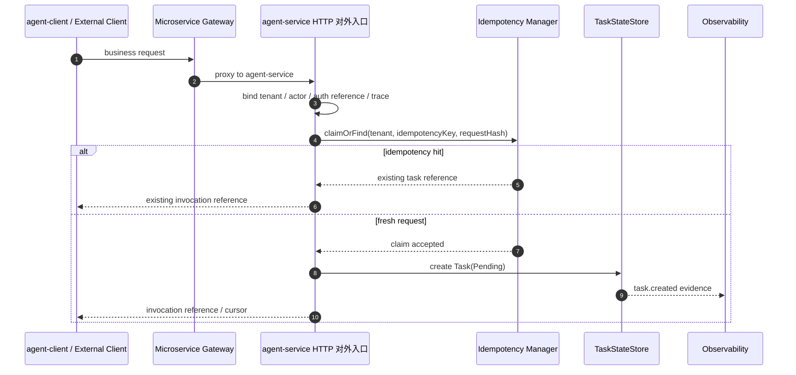
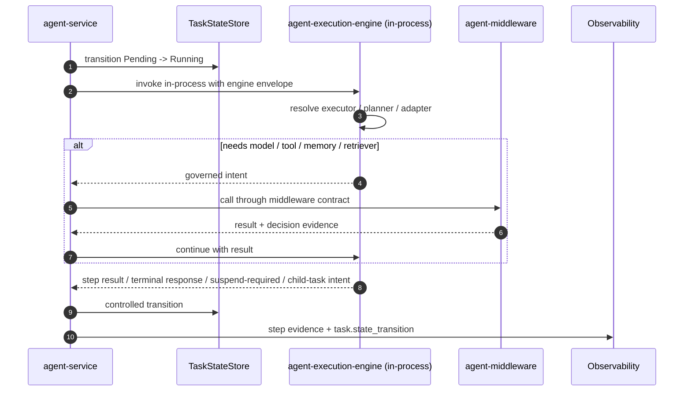
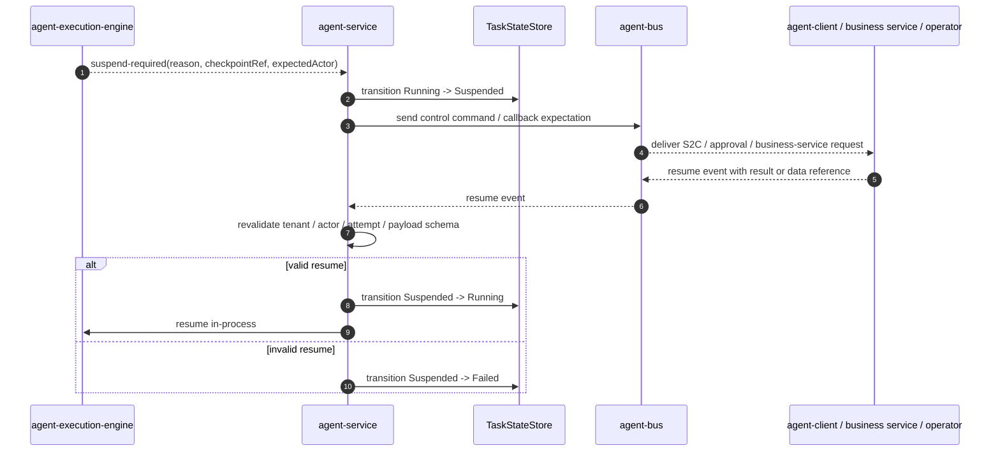
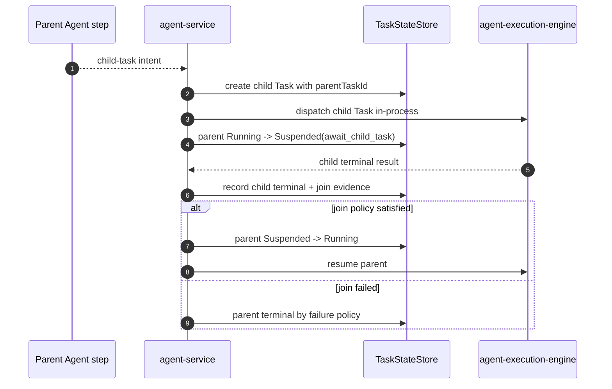
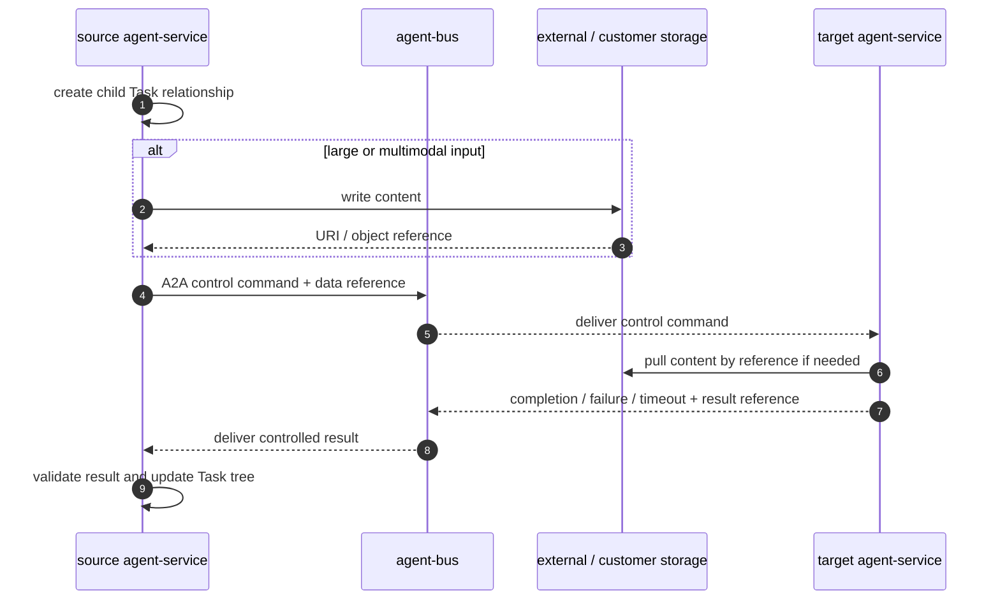
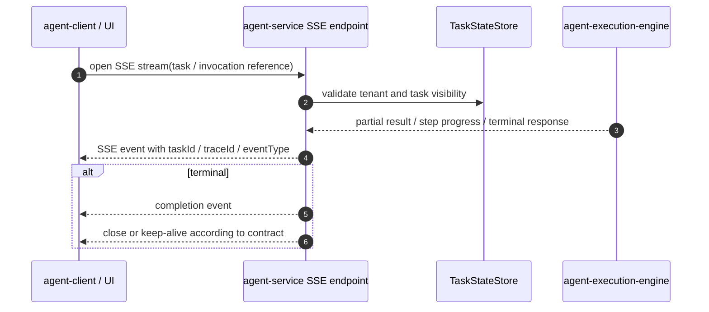
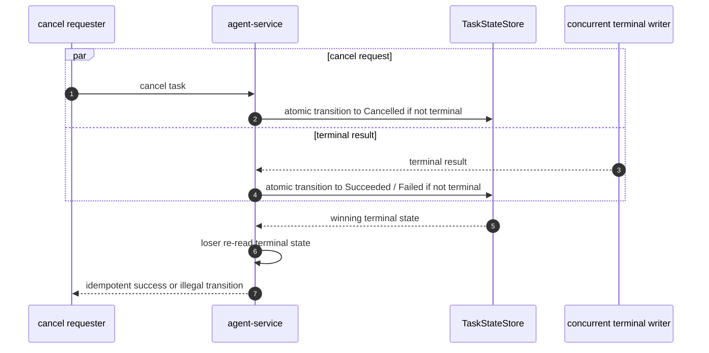

# Agent Service Process Design

## 目的

把旧 L1 `process.md` 的序列和失败流翻译为当前架构口径，用于生成可执行 harness。本文关注流程、状态推进、跨模块协作和失败语义，不写具体接口字段和方法签名。

## 流程索引

| Process ID | 名称 | 覆盖切片 | 对应场景 |
|---|---|---|---|
| P1 | 标准业务请求进入并创建 Task | AS-SLICE-001, 002 | BA-001, S1 |
| P2 | 同进程执行 Agent step | AS-SLICE-003, 004 | S2 |
| P3 | 需要本地能力或审批时 suspend / resume | AS-SLICE-005, 006 | BA-002, S5 |
| P4 | 同一 service 内多 Agent child Task / join | AS-SLICE-007 | BA-003, S6 |
| P5 | 跨边界 A2A 控制指令和 data reference | AS-SLICE-008 | BA-003, S6 |
| P6 | SSE 实时输出 | AS-SLICE-009 | BA-001 |
| P7 | cancel / terminal 竞争处理 | AS-SLICE-003, 011 | S1, S2, S5 |

## P1 标准业务请求进入并创建 Task

### P1 断言

- Gateway 只代理到 `agent-service`，不写 Task State。
- 同 tenant + equivalent request + idempotency key 只创建一个 Task。
- tenant mismatch 不泄露其他租户 Task 信息。
- 创建失败不得产生半创建状态。

## P2 同进程执行 Agent step

### P2 断言

- `agent-service` 与 engine 是同进程调用，不引入远程 service-to-engine 边界。
- engine 不直接写 Task State。
- middleware 调用经过 service / middleware contract，不由 engine 私自绕过治理。
- step result 必须产生结构化 evidence。

## P3 suspend / resume

### P3 断言

- suspend 前必须有 checkpointRef 或等价 resume payload。
- resume 必须重新校验 tenant、actor、attempt 和 payload schema。
- Bus 只传控制和 data reference，不传大型 payload。
- duplicate resume 不重复副作用。

## P4 同一 service 内多 Agent child Task / join

### P4 断言

- 同一 `agent-service` 进程内多 Agent 协作不经过 Bus。
- child Task 必须有 parentTaskId、delegation reason、join policy。
- duplicate child completion 不重复合并。

## P5 跨边界 A2A 控制指令和 data reference

### P5 断言

- 跨 service / 跨部门 / 跨部署 A2A 控制指令必须走 Bus。
- Bus envelope 只包含控制语义、identity、trace、policy 和 data reference。
- 大型内容由需求方按授权直接从 data path 拉取。
- A2A 流式回传不默认走 Bus 逐 token 事件。

## P6 SSE 实时输出

### P6 断言

- SSE event 必须关联 taskId、tenant scope 和 traceId。
- SSE 不写 Task State，只发布实时输出。
- Bus 不承载逐 token stream。

## P7 cancel / terminal 竞争处理

### P7 断言

- cancel / complete 竞争只有一个获胜写入。
- 输掉竞争的一方必须重新读取 Task 终态。
- 同状态 terminal 请求可幂等成功；不同 terminal 返回 illegal transition。
- 所有路径都有 audit / evidence。

