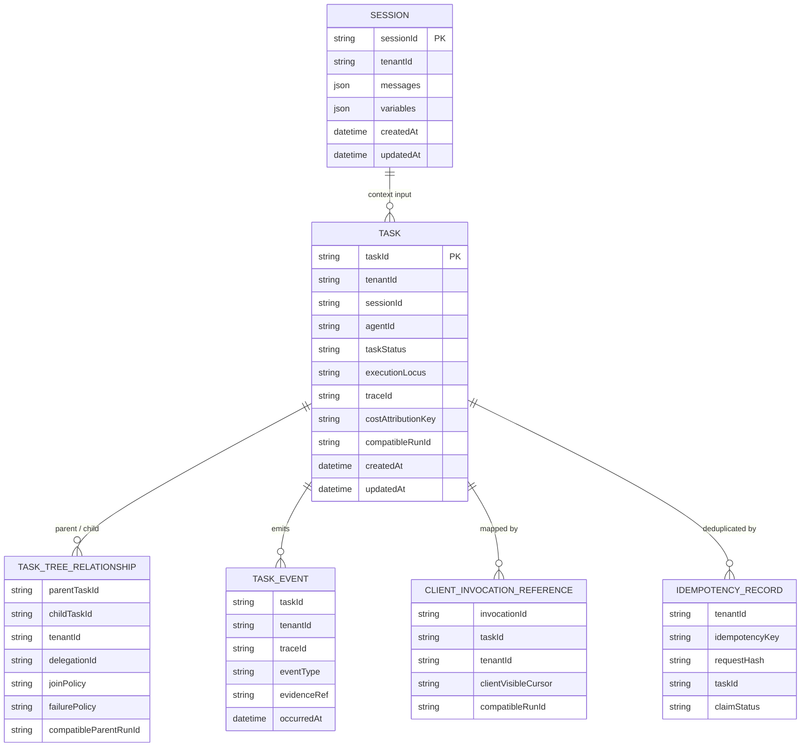
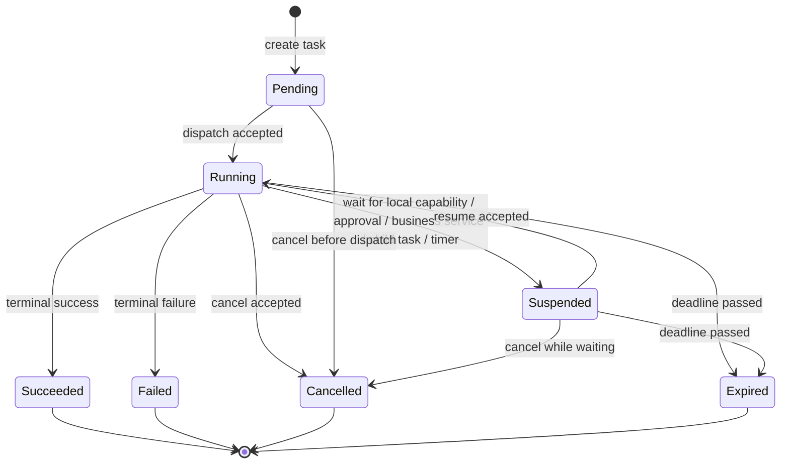

# Agent Service State Model

## 目的

把旧 L1 中 Run / Task / Session / RunEvent 的高密度状态设计翻译为当前架构口径：服务端 canonical 状态是 Task，历史 Run 命名只作为实现兼容或 client invocation 兼容表达。

## 状态命名迁移规则

| 旧设计项 | 当前口径 | 迁移规则 |
|---|---|---|
| Run aggregate | Task lifecycle / Task Execution State | 迁移为 Task canonical；Run 只作为历史实现兼容名。 |
| RunStatus | TaskStatus / Task Execution State | 状态语义保留，名称按 Task 表达。 |
| RunRepository | TaskStateStore controlled transition path；历史 RunRepository 兼容入口 | 允许实现暂用旧名，但不得形成第二套 owner。 |
| RunStateMachine | Task state machine；历史 RunStateMachine 兼容入口 | 校验语义保留，状态 owner 归 `agent-service`。 |
| RunEvent | TaskEvent / Execution Evidence Event | 事件语义保留，命名按 Task / evidence 表达；旧名仅兼容。 |
| parentRunId | parentTaskId / childTaskId；parentRunId 兼容字段 | Task tree 以 Task identity 为主。 |

## 核心实体关系

## Task 状态机

## 状态转换规则

| Rule | 内容 | Harness 断言 |
|---|---|---|
| ST-R-001 | 所有 Task 状态写入必须经过 `agent-service` controlled transition path。 | `task_state_written_only_by_agent_service_controlled_entry` |
| ST-R-002 | Terminal 状态之后不得再次产生业务副作用。 | `duplicate_resume_does_not_duplicate_side_effect` |
| ST-R-003 | cancel 与 complete 竞争时，只允许一个 CAS / atomic transition 获胜。 | `cancel_complete_race_has_single_winner` |
| ST-R-004 | 同 tenant + equivalent request + idempotency key 不得创建重复 Task。 | `task_created_once_for_duplicate_request` |
| ST-R-005 | client invocation reference 不得成为第二套服务端 Run State。 | `client_invocation_reference_maps_to_task_only` |
| ST-R-006 | parent / child 关系由 `agent-service` 写入，Bus 和 engine 不得直接创建 Task tree。 | `task_tree_written_only_by_agent_service` |

## 历史 RunStatus 兼容映射

| Historical RunStatus | Task Status | 说明 |
|---|---|---|
| `PENDING` | `Pending` | 任务已创建，尚未执行。 |
| `RUNNING` | `Running` | 任务正在执行或正在推进 step。 |
| `SUSPENDED` | `Suspended` | 等待外部输入、审批、local capability、child Task 或 timer。 |
| `SUCCEEDED` | `Succeeded` | 成功终态。 |
| `FAILED` | `Failed` | 失败终态。 |
| `CANCELLED` | `Cancelled` | 取消终态。 |
| `EXPIRED` | `Expired` | 超时终态。 |

## TaskEvent / Evidence Event 草案

| Event Type | 来源 | 最小字段 | 旧 RunEvent 兼容 |
|---|---|---|---|
| `task.created` | AS-L2 | taskId, tenantId, traceId, invocationRef | `RunCreatedEvent` |
| `task.state_transition` | AS-L2 | taskId, fromStatus, toStatus, reason, actor | `RunStateTransitionEvent` |
| `task.suspend_requested` | AS-L4 / AS-L5 | taskId, suspendReason, checkpointRef, expectedActor | `SuspendRequestedEvent` |
| `task.resume_requested` | AS-L5 | taskId, resumeCause, payloadRef, actor | `ResumeRequestedEvent` |
| `s2c.callback_requested` | AS-L5 | taskId, callbackId, capability, dataReference | `S2cCallbackRequestedEvent` |
| `s2c.callback_completed` | AS-L5 | taskId, callbackId, outcome | `S2cCallbackCompletedEvent` |
| `child_task.created` | AS-L5 | parentTaskId, childTaskId, delegationId, joinPolicy | `ChildRunSpawnedEvent` |
| `child_task.completed` | AS-L5 | parentTaskId, childTaskId, terminalStatus | `ChildRunCompletedEvent` |
| `task.cancel_requested` | AS-L1 / AS-L2 | taskId, actor, reason | `CancelRequestedEvent` |
| `task.terminal` | AS-L2 | taskId, terminalStatus, finalReason | `TerminalTransitionEvent` |

## Cancel / Complete 竞争语义

当 cancel 请求和 engine terminal result 同时到达时：

1. 两者都只能调用 `agent-service` controlled transition path。
2. 受控入口必须以 atomic compare-and-set 或等价机制保证只有一个 transition 成功。
3. 输掉竞争的一方重新读取 Task 终态。
4. 如果终态与请求语义一致，返回幂等成功；如果不一致，返回 illegal transition 或等价错误。
5. 无论成功还是失败，都必须产生 audit / evidence 事件。

## Forbidden Writers

| State | Forbidden Writers |
|---|---|
| Task Execution State | Gateway, agent-bus, agent-client, agent-execution-engine, agent-middleware, Tool Gateway capability, business code |
| Task Tree Relationship | agent-bus, remote service direct write, engine adapter direct write |
| Client Invocation Reference server mapping | agent-client direct server write, Gateway, Bus |
| Session State | engine adapter, Bus, middleware direct mutation without service contract |
| TaskEvent / Audit | business code overwrite, provider adapter direct sink bypass |

