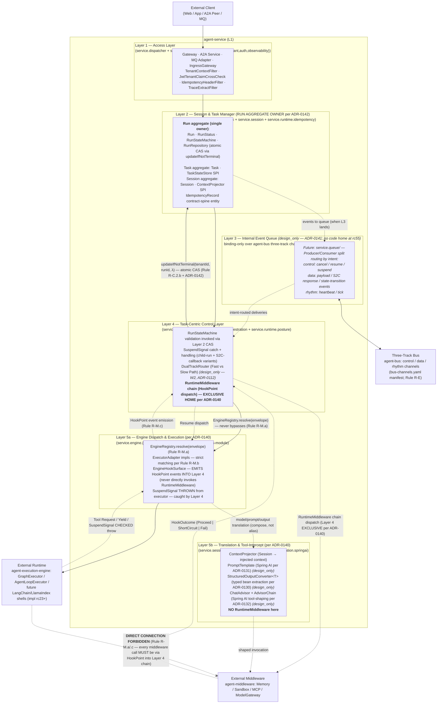
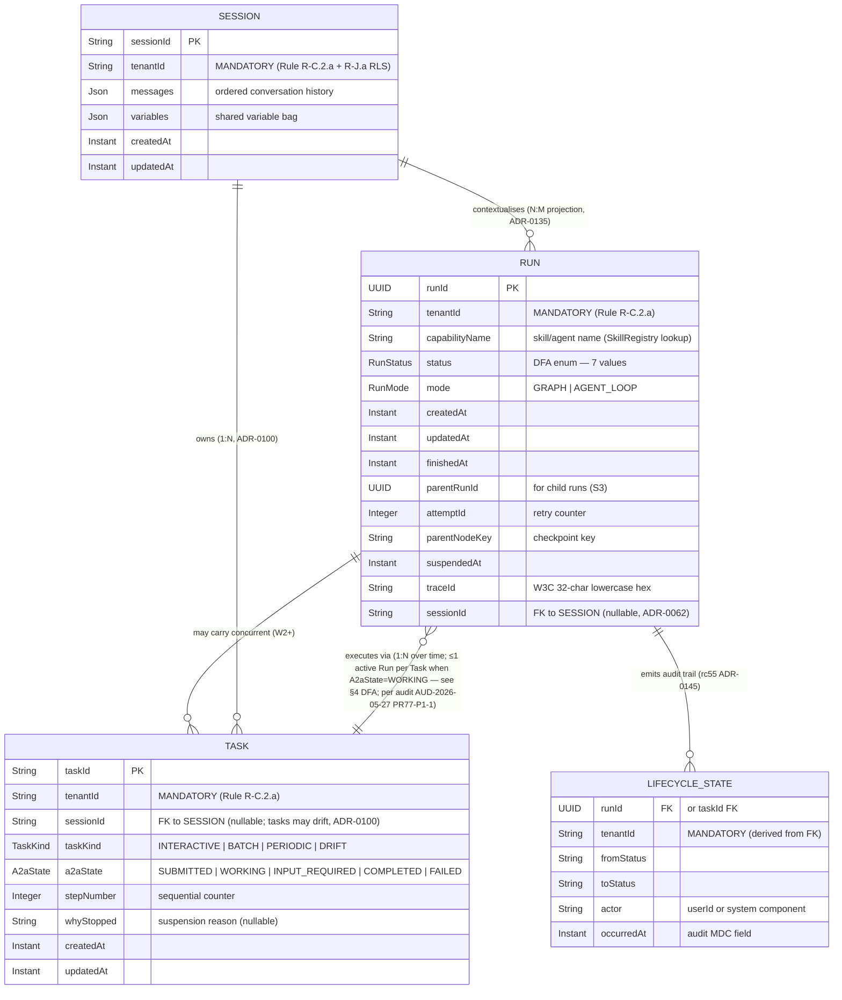
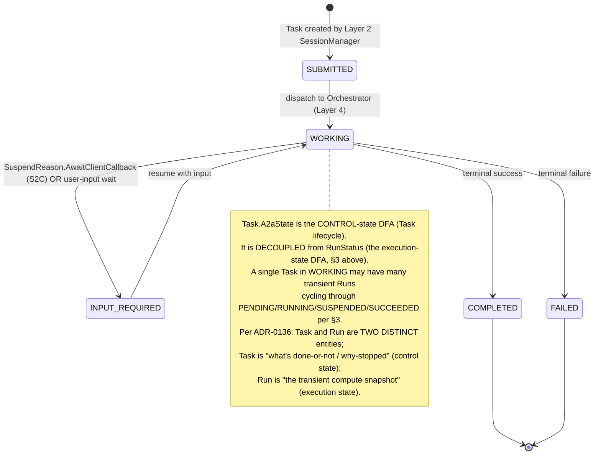
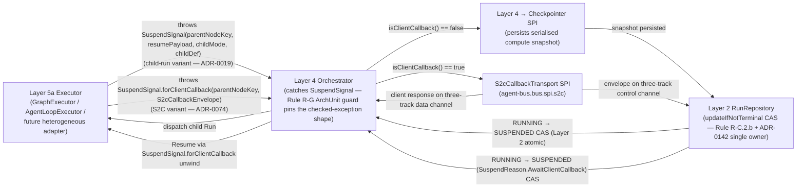

# agent-service — Logical View

> Authoring source: rc53 review file §15 (`docs/logs/reviews/2026-05-26-agent-service-l1-4plus1-rewrite-wave-1.en.md`), ported in rc55 W3 with the following corrections from the rc55 audit:
>
> - **R1** (`F-layer-decomposition-low-cohesion`): Layer 5 (Engine Adapter Layer) is SPLIT into 5a (Engine Dispatch & Execution) and 5b (Translation & Tool-Intercept) per ADR-0140. RuntimeMiddleware lives EXCLUSIVELY in Layer 4 — no more double-homing.
> - **R3** (same family): Run aggregate (`Run` + `RunStatus` + `RunStateMachine` + `RunRepository`) is owned EXCLUSIVELY by Layer 2 per ADR-0142. Layer 4 holds typed reference to `RunRepository` and invokes `updateIfNotTerminal(...)`; Layer 4 NEVER writes Run state directly.
> - **R4** (`F-cross-authority-agreement`): `ChatAdvisor` and `RuntimeMiddleware` are DISTINCT mechanisms (different cardinality, different scopes) — see §6 glossary. They compose; they are NOT aliases.
> - **R8** (`F-discriminator-without-discriminated-type`): the sealed `RunEvent` hierarchy is specified per ADR-0145 with 10 variants covering S1-S5 emissions — see §7. Java sealed type lands in a follow-up impl-mode wave; contract status currently `design_only` per `docs/contracts/run-event.v1.yaml`.

## 1. Five-Layer Component Diagram (rc55 corrected)



**Layer responsibilities** (canonical per ADR-0138 + ADR-0140/0142
narrowings):

1. **Access Layer (Layer 1)** — Inbound protocol convergence
   (HTTP/gRPC via `openapi-v1.yaml`; A2A via `a2a-envelope.v1.yaml`
   `(design_only)`; MQ via `ingress-envelope.v1.yaml` `(design_only —
   W3+)`). Performs tenant binding (`TenantContextFilter` + JWT
   cross-check per ADR-0040), idempotency claim (per ADR-0057), trace
   originization (per ADR-0061). Layer 1 NEVER drives Runtime
   directly (Rule R-M.a) and NEVER calls Middleware directly (Rule
   R-M.c).

2. **Session & Task Manager (Layer 2 — Run aggregate single owner per
   ADR-0142)** — Owns the Run / Task / Session record lifecycles AND
   the Run aggregate's invariants. Persistence under RLS (Rule R-J.a)
   with `RunRepository.updateIfNotTerminal(...)` atomic CAS as the
   SINGLE sanctioned status-transition path (Rule R-C.2.b + ADR-0118
   + ADR-0142). Session ↔ Task 1:N per ADR-0100. State-machine
   validation (`RunStateMachine.validate(from, to)`) is invoked
   atomically inside `updateIfNotTerminal(...)` — callers don't
   invoke the validator directly.

3. **Internal Event Queue (Layer 3 — design_only per ADR-0141)** —
   Binding-only layer over the canonical three-track channels
   declared in `bus-channels.yaml` per Rule R-E. Producer/Consumer
   split routes events by intent: `control` (cancel / resume / suspend
   broadcasts), `data` (payload / S2C response / state-transition
   events), `rhythm` (heartbeat / tick). Per-channel durability tier
   is the orthogonal axis (W0/W1 in-memory stubs; W2+ durable
   backends). The "in-memory / semi-persistent / persistent"
   durability is NOT a peer to channel choice — they are orthogonal.
   **No code home at rc55** (`service.queue/` does NOT exist on disk);
   the layer appears in this diagram as a `(design_only)` sub-block to
   make the binding contract visible, NOT as a peer to layers with
   code homes.

4. **Task-Centric Control Layer (Layer 4 — RuntimeMiddleware exclusive
   home per ADR-0140)** — Orchestrator + state-machine validation
   delegation + DualTrackRouter `(design_only)` + RuntimeMiddleware
   chain. Where Runtime would otherwise call Middleware directly, the
   call is converted to a `HookPoint` event (per Rule R-M.c +
   `engine-hooks.v1.yaml`) and dispatched through the middleware
   chain. SuspendSignal handling (child-run + S2C-callback variants)
   lives here. Run state writes ALWAYS go through Layer 2's
   `updateIfNotTerminal(...)` per ADR-0142.

5. **Engine Dispatch & Execution Layer (Layer 5a — per ADR-0140
   split)** — `EngineRegistry.resolve(envelope)` per Rule R-M.a.
   `ExecutorAdapter` implementations for Graph
   (`SequentialGraphExecutor`) and AgentLoop
   (`IterativeAgentLoopExecutor`); future heterogeneous adapters for
   LangChain / LlamaIndex are shells declared design_only at W1,
   implementation deferred. Layer 5a EMITS HookPoint events INTO
   Layer 4's RuntimeMiddleware chain; Layer 5a NEVER directly invokes
   RuntimeMiddleware (this is the cohesion-fix from ADR-0140).

6. **Translation & Tool-Intercept Layer (Layer 5b — per ADR-0140
   split)** — `ContextProjector` (Session → InjectedContext) +
   `PromptTemplate` (Spring AI per ADR-0131) +
   `StructuredOutputConverter<T>` (typed-bean extraction per ADR-0130)
   + `ChatAdvisor` + `AdvisorChain` (Spring AI tool-shaping per
   ADR-0132). Compose Spring AI primitives into the model invocation
   pipeline shape. No RuntimeMiddleware here. Spring AI evolution
   cadence is independent of Layer 5a's Rule R-M evolution cadence
   (the rationale for the ADR-0140 split).

## 2. ER Model — Run / Task / Session / LifecycleState (tenantId-first)

> **Red-line (Rule R-C.2.a + R-J.a + Principle P-J):** every entity
> below MUST declare `tenantId` as a first-class field. Verified
> against shipped Java: `Run.java:25`, `Task.java:31`, `Session.java:27`.



**Tenant isolation enforcement** (cross-cutting):
- Every table above carries `tenant_id` column with RLS policy enabled
  in the same Flyway migration that creates the table (Rule R-J.a).
  `IdempotencyRecord` (`V2__idempotency_dedup.sql`) ships RLS-bound;
  the legacy table is grandfathered in `gate/rls-baseline-grandfathered.txt`
  pending W2 retrofit (Rule R-J.a.b deferred).
- Run aggregate ownership pinning (ADR-0142): Layer 2 is the SINGLE
  writer; Layer 4 holds typed `RunRepository` reference + invokes
  `updateIfNotTerminal(...)`. Future ArchUnit test
  `Layer4MustNotImportRunDirectlyTest` candidate (W2+).

## 3. RunStatus State Machine (cancel-race-aware, CAS-annotated)

```mermaid
stateDiagram-v2
    [*] --> PENDING: POST /v1/runs (Access Layer 1)<br/>RunRepository.save (insert; RLS-scoped; create-only path per rc39 source-guard)
    PENDING --> RUNNING: Orchestrator dispatch (Layer 4 → Layer 2)<br/>RunRepository.updateIfNotTerminal CAS
    RUNNING --> SUSPENDED: SuspendSignal thrown by Layer 5a<br/>(child-run OR S2C callback)<br/>Layer 4 → RunRepository.updateIfNotTerminal CAS
    SUSPENDED --> RUNNING: ResumeDispatcher (Layer 4)<br/>tenant guard re-check (W2 widening per Rule R-J.b.d)<br/>RunRepository.updateIfNotTerminal CAS
    RUNNING --> SUCCEEDED: terminal success<br/>RunRepository.updateIfNotTerminal CAS
    RUNNING --> FAILED: terminal failure<br/>RunRepository.updateIfNotTerminal CAS
    SUSPENDED --> FAILED: ResumeDispatcher gives up<br/>RunRepository.updateIfNotTerminal CAS
    RUNNING --> CANCELLED: POST /v1/runs/{runId}/cancel<br/>**(request.tenantId == Run.tenantId) guard (Rule R-J.b)**<br/>**RunRepository.updateIfNotTerminal CAS**
    SUSPENDED --> CANCELLED: POST /v1/runs/{runId}/cancel<br/>same guards
    PENDING --> CANCELLED: POST /v1/runs/{runId}/cancel<br/>same guards
    RUNNING --> EXPIRED: deadline pass<br/>RunRepository.updateIfNotTerminal CAS
    SUSPENDED --> EXPIRED: deadline pass<br/>RunRepository.updateIfNotTerminal CAS
    FAILED --> RUNNING: retry per ADR-0118<br/>RunRepository.updateIfNotTerminal CAS (FAILED is NOT closed-terminal per RunStateMachine.java:37; W2-scoped retry policy decides re-enter)

    CANCELLED --> [*]
    SUCCEEDED --> [*]
    EXPIRED --> [*]

    note right of CANCELLED
        Same-status terminal cancel returns 200 (idempotent).
        Different-terminal cancel returns 409 illegal_state_transition.
        Cross-tenant cancel collapses to 404 not_found at W0
        (W1 widening to 403 tenant_mismatch + WARN audit
         deferred per ADR-0108 / Rule R-J.b).
    end note

    note left of RUNNING
        EVERY transition through Layer 2's RunRepository.updateIfNotTerminal
        atomic CAS (abstract method per ADR-0118 + ADR-0142 single-owner pinning).
        Layer 4 NEVER writes Run state directly.
        Defends against F-nonatomic-run-status-write
        (5 prior recurrences: rc35-batch / rc35-second-pass / rc36 / rc38 / rc39).
    end note
```

**Cancel-vs-complete race resolution**: when two writers contend (e.g.
a `RunController.cancel` and an orchestrator's terminal `SUCCEEDED`
racing on the same `runId`), the atomic CAS `WHERE status NOT IN
(CANCELLED, SUCCEEDED, FAILED, EXPIRED)` clause admits exactly one.
The loser re-reads, sees the post-CAS Run row, and returns the
appropriate response (200 if the winning state matches the requested
transition, 409 if not). The state machine therefore models the race
**structurally**, not by retry-and-pray. See [`process.md`](process.md)
§P6 for the explicit loser-side sequence diagram (O3 audit finding
from rc55 W0).

## 4. Task.A2aState State Machine (A2A Protocol Envelope)



## 5. SuspendSignal Flow (Child-Run + S2C-Callback Variants)



The two `SuspendSignal` variants share **the same checked-exception
type signature** — a deliberate design per ADR-0100 §rejected-framings
#2 (Yield/SuspendSignal coexistence) and reaffirmed by ADR-0137: one
Java compiler guard, one Rule R-G ArchUnit guard, one Rule R-H "no
`Thread.sleep`" enforcement scope. PR #71's proposed
`InterruptSignal`-style rename was rejected by ADR-0137 because the
checked-exception shape is a Tier-A competitive differentiator
(the Java compiler enforces caller-side handling at 29+ call sites).

## 6. Vocabulary Glossary — Distinct Mechanisms, Not Aliases (R4 correction)

The rc55 audit (R4 finding) called out that ADR-0136's §3 glossary
mapping read `ChatAdvisor + RuntimeMiddleware → "Shadow Tool
Interceptor"` as if the two were aliases. They are NOT. The corrected
mapping below is the canonical L1 vocabulary:

| Concept | Mechanism A | Mechanism B | Why they're distinct |
|---|---|---|---|
| Tool intercept | `RuntimeMiddleware` listening on `HookPoint.before_tool` / `HookPoint.after_tool` (Rule R-M.c; Layer 4 EXCLUSIVE per ADR-0140) | `ChatAdvisor.aroundCall(...)` (Spring AI per ADR-0132; Layer 5b) | Different cardinality: RuntimeMiddleware fires per HookPoint per Run; ChatAdvisor fires per model-call invocation per ChatClient. Different scopes: RuntimeMiddleware sees the hook-point boundary; ChatAdvisor sees the model-call boundary. They COMPOSE — a tool-call boundary may trigger BOTH a `before_tool` HookPoint (Layer 4) AND a `ChatAdvisor.aroundCall` (Layer 5b) — they are not aliases. |
| Cross-cutting policy | `RuntimeMiddleware` chain (Layer 4) | `RequestPostProcessor` / `MeterFilter` / Spring Security filter (Layer 1 platform infra) | RuntimeMiddleware is Runtime-domain (orchestration-aware, HookPoint-driven). The Layer 1 filter chain is HTTP-edge-domain (request-aware, servlet filter chain). |
| Context injection | `ContextProjector.project(session)` (Layer 5b) → `InjectedContext` | `PromptTemplate.render(template, vars)` (Layer 5b) → `RenderedPrompt` | ContextProjector projects Session state into the InjectedContext shape; PromptTemplate renders a template against that context to produce the prompt string. The two compose serially: `ContextProjector` THEN `PromptTemplate`. |

Other vocabulary mappings (rc55 reaffirmation; full table in ADR-0136
§3):

| PR #71 / academic name | Shipped platform name (canonical) |
|---|---|
| Task (as "scheduling core") | `Task` (control-state record, `service.task.Task`) — distinct from Run |
| TaskManager | TaskCenter sub-package + `TaskStateStore` SPI (per ADR-0100; rc55 audit M4 corrected stale "TaskRepository" naming) |
| TaskEvent | `RunEvent` sealed hierarchy variants (per ADR-0145; §7 below) — NO standalone `TaskEvent` Java type |
| InterruptSignal | `SuspendSignal` (`bus.spi.engine.SuspendSignal`, checked exception) — glossary synonym only per ADR-0137 |
| InterruptType (INPUT_REQUIRED / TOOL_EXECUTION / COLLABORATION / SAFETY_CHECK) | Maps onto 3 platform mechanisms: A2A state for input-required, HookPoint for tool, SuspendReason for collaboration / safety |
| Internal Event Queue | Three-track bus: `control` / `data` / `rhythm` (`bus-channels.yaml`, Rule R-E); Layer 3's binding role per ADR-0141 (`design_only`) |
| DualTrackRouter | New SPI `(design_only — W2, ADR-0112)`; maps to `SlowTrackJudge` (already declared per ADR-0112); narrowed by ADR-0139 |
| FastPath / SlowPath | In-process reactive synchronous + metadata persistence (Fast) vs persistent reactive + SuspendSignal + ResumeDispatcher (Slow); neither bypasses tenantId / RLS / reactive / SuspendSignal (per ADR-0139 narrowed semantics) |

**v1.2 (per ADR-0155 §3)**: M6 Translation & Tool-Intercept does NOT
construct prompts. The Agent (native code, third-party framework
Formatter, or remote service) owns prompt assembly. M6 is a
messages-in-flight boundary aspect — policy, redaction, token-budget
audit, fallback trim. `BuiltPrompt` is deleted; `GovernedMessages`
replaces it as M6's downstream type.

## 7. RunEvent Sealed Hierarchy (per ADR-0145)

<<<<<<<< HEAD:docs/architecture/l0/l1/agent-service/logical.md
> **Status**: `design_only` per [`docs/contracts/run-event.v1.yaml`](../../../../contracts/run-event.v1.yaml). The Java sealed `RunEvent` interface + 10 record variants land in a follow-up impl-mode wave. Until then, Rule R-M.e (Every emitted `RunEvent` declares `EvolutionExport`) is design-armed but not actively gated. `EvolutionExport` enum already ships at `agent-service.../runtime/evolution/EvolutionExport.java`.
========
> **Status**: `design_only` per [`docs/contracts/run-event.v1.yaml`](../../../../docs/contracts/run-event.v1.yaml). The Java sealed `RunEvent` interface + 10 record variants land in a follow-up impl-mode wave. Until then, Rule R-M.e (Every emitted `RunEvent` declares `EvolutionExport`) is design-armed but not actively gated. `EvolutionExport` enum already ships at `agent-service.../runtime/evolution/EvolutionExport.java`.
>>>>>>>> origin/main:architecture/docs/L1/agent-service/logical.md



```mermaid
classDiagram
    class RunEvent {
        <<sealed interface>>
        +UUID runId
        +UUID tenantId  Rule_R-C-2-a
        +String traceId
        +Instant occurredAt
        +EvolutionExport evolutionExport  Rule_R-M-e
    }
    class RunCreatedEvent {
        <<record>>
        +String capabilityName
        +RunMode runMode
        +UUID parentRunId
        +UUID sessionId
        +evolutionExport = IN_SCOPE
    }
    class RunStateTransitionEvent {
        <<record>>
        +RunStatus fromStatus
        +RunStatus toStatus
        +String reason
        +evolutionExport = IN_SCOPE
    }
    class SuspendRequestedEvent {
        <<record>>
        +String parentNodeKey
        +String suspendReason
        +evolutionExport = IN_SCOPE
    }
    class ResumeRequestedEvent {
        <<record>>
        +ResumeCause resumeCause
        +String resumePayloadKey
        +evolutionExport = IN_SCOPE
    }
    class S2cCallbackRequestedEvent {
        <<record>>
        +S2cCallbackEnvelope envelope
        +String capability
        +evolutionExport = OPT_IN
    }
    class S2cCallbackCompletedEvent {
        <<record>>
        +String callbackId
        +CallbackOutcome outcome
        +evolutionExport = OPT_IN
    }
    class ChildRunSpawnedEvent {
        <<record>>
        +UUID childRunId
        +RunMode childRunMode
        +JoinPolicy joinPolicy
        +evolutionExport = IN_SCOPE
    }
    class ChildRunCompletedEvent {
        <<record>>
        +UUID childRunId
        +RunStatus childTerminalStatus
        +evolutionExport = IN_SCOPE
    }
    class CancelRequestedEvent {
        <<record>>
        +String actor
        +String cancelReason
        +evolutionExport = IN_SCOPE
    }
    class TerminalTransitionEvent {
        <<record>>
        +RunStatus terminalStatus
        +String finalReason
        +evolutionExport = IN_SCOPE
    }

    RunEvent <|-- RunCreatedEvent
    RunEvent <|-- RunStateTransitionEvent
    RunEvent <|-- SuspendRequestedEvent
    RunEvent <|-- ResumeRequestedEvent
    RunEvent <|-- S2cCallbackRequestedEvent
    RunEvent <|-- S2cCallbackCompletedEvent
    RunEvent <|-- ChildRunSpawnedEvent
    RunEvent <|-- ChildRunCompletedEvent
    RunEvent <|-- CancelRequestedEvent
    RunEvent <|-- TerminalTransitionEvent
```

- `ResumeAccepted { runId }` — emitted when M5 EDE-07 successfully injects the adapter on a RESUME_TICK; consumed by M4 TCC-06B to drive RESUMING → RUNNING. Per ADR-0155 H3 audit reversal.

**Emission discipline** (in the future Java impl):
- `RunCreatedEvent` emitted by Layer 2 `RunRepository.save(...)` — the
  only create-only call-site allowed per the rc39 ADR-0118 source-guard.
- `RunStateTransitionEvent` emitted by Layer 2
  `RunRepository.updateIfNotTerminal(...)` AFTER the atomic CAS
  succeeds (so emission and state-transition are atomic per Rule R-C.2.b).
- Suspend / Resume / S2C events emitted by Layer 4 Control AFTER its
  `updateIfNotTerminal(...)` call to Layer 2.
- Cancel events emitted by `RunController.cancel` AFTER its
  `updateIfNotTerminal(...)` call.
- All events published to Layer 3 Internal Event Queue (when its
  code home lands per ADR-0141) via the appropriate channel
  (`control` / `data` / `rhythm` per Rule R-E intent routing per the
  `channel_routing` block of `docs/contracts/run-event.v1.yaml`).

**Scenario coverage matrix** (per ADR-0145; cross-walk to
[`scenarios.md`](scenarios.md) §1-§5):

| Variant | S1 | S2 | S3 | S4 | S5 (winner) | S5 (loser) |
|---|:-:|:-:|:-:|:-:|:-:|:-:|
| RunCreatedEvent | ✓ | ✓ | ✓ (parent + child) | ✓ | (pre-existing) | (pre-existing) |
| RunStateTransitionEvent | ✓ (PENDING→RUNNING→SUCCEEDED) | ✓ (with SUSPEND/RESUME cycle) | ✓ | ✓ | ✓ (→CANCELLED) | — (CAS no-op) |
| SuspendRequestedEvent | — | ✓ | ✓ (parent) | ✓ | — | — |
| ResumeRequestedEvent | — | ✓ | ✓ (parent) | ✓ | — | — |
| S2cCallbackRequestedEvent | — | — | — | ✓ | — | — |
| S2cCallbackCompletedEvent | — | — | — | ✓ | — | — |
| ChildRunSpawnedEvent | — | — | ✓ | — | — | — |
| ChildRunCompletedEvent | — | — | ✓ | — | — | — |
| CancelRequestedEvent | — | — | — | — | ✓ | ✓ (rejection audit signal) |
| TerminalTransitionEvent | ✓ (SUCCEEDED) | ✓ | ✓ (parent + child) | ✓ | ✓ (CANCELLED) | — |

## 8. Configuration ownership matrix (per-module sovereign vs read-only)

> Absorbed from PR #79 / `docs/logs/reviews/2026-05-26-agent-service-module-capability-feature-list.{cn,en}.md` §5 per the post-merge audit Wave 3 plan. Configuration MUST NOT be scattered across request bodies, adapter-private fields, or prompt templates — L1 first names the sovereign module and the read-only consumers.

| Configuration category | Sovereign module | Read-only / consumer modules | Required information | Exception closure |
| --- | --- | --- | --- | --- |
| Client identity and access capability | Access Layer | Session & Task Manager, Task-Centric Control Layer | clientId, tenant binding, auth posture, SSE / polling / callback transport, client-hosted skill advertisement. | Stale client capability, unavailable transport, tenant mismatch. |
| Agent identity and service capability | Access Layer + Engine Dispatch & Execution | Task-Centric Control Layer, Translation & Tool-Intercept | AgentCard / capability publication, engine_type, supported run modes, streaming / tool / callback / delegation support. | Capability advertisement disagrees with EngineRegistry strict matching. |
| Run-creation configuration snapshot | Session & Task Manager | All execution-related modules | Snapshot or reference for resolved model profile, engine profile, adapter profile, tool profile, routing posture, and client callback posture. | Unexplainable config drift during resume / retry. |
| Model information | Translation & Tool-Intercept | Engine Dispatch & Execution, Task-Centric Control Layer | Provider, model id, options, streaming support, structured-output support, cost / quota tags. | Unsupported option, quota exceeded, provider drift, schema mismatch. |
| Third-party Agent adapter information | Engine Dispatch & Execution | Access Layer, Task-Centric Control Layer, Session & Task Manager | adapter id, endpoint, auth mode, remoteAgentId, remoteThreadId / remoteTaskId schema, resume token schema, timeout / retry policy. | Cannot recover same remote invocation, credential scope error, adapter version drift. |
| Client-hosted skill information | Access Layer + Task-Centric Control Layer | Translation & Tool-Intercept, Engine Dispatch & Execution | skill name, capability schema, permission posture, callback transport, result schema, timeout. | Client skill unavailable, over-permission, invalid result schema, callback timeout. |
| Tool / sandbox / skill capacity | Task-Centric Control Layer | Translation & Tool-Intercept, Engine Dispatch & Execution | skill-capacity, sandbox policy, tool allowlist, quota, memory access policy, HookPoint policy. | Policy bypass, over-wide grant, capacity exhausted, missing audit. |
| Channel and delivery policy | Internal Event Queue | Session & Task Manager, Task-Centric Control Layer | control / data / rhythm physical channel, durability tier, lease, ack, retry, dead-letter, inline payload cap. | Control starvation, poison message, payload too large, invisible dead-letter. |

## 9. Orthogonality red-lines (correct vs incorrect splits)

> Absorbed from PR #79 / `docs/logs/reviews/2026-05-26-agent-service-module-capability-feature-list.{cn,en}.md` §7 per the post-merge audit Wave 3 plan. These are the 8 layer/module boundaries this L1 design REFUSES to collapse; violating any of them is a recurrence trigger for `F-layer-decomposition-low-cohesion` (rc55 / ADR-0144).

| Boundary | Correct split | Incorrect split |
| --- | --- | --- |
| SSE / polling vs Run lifecycle | Access Layer owns connection and projection; Run lifecycle is owned by Session & Task Manager plus Task-Centric Control Layer. | SSE disconnect cancels Run, or polling directly reads engine internals. |
| Direct access vs bypass | Client may directly access Agent Service Access Layer; it must not directly access engines, repositories, middleware, or bus channels. | Letting clients call ExecutorAdapter or agent-bus topics for low latency. |
| Run vs Task vs Session | Run owns execution state; Task owns protocol/control state; Session owns context state. | One StateStore swallowing Run, Task, and Session. |
| Checkpoint vs Session / Memory | Checkpoint is a compute snapshot; Session / Memory are context and knowledge sources of truth. | Using checkpoint as a replacement for Session projection or Memory mutation discipline. |
| Retry vs new Agent scheduling | Retry / resume first reuses the same Run, attempt, remote handle, or child-Run relationship. | Silently creating a new remote Agent after third-party interruption, causing duplicate side effects and broken audit. |
| Client-hosted skill vs server tool | Client skill uses S2C callback and policy control; server tool uses RuntimeMiddleware and sandbox control. | Engine adapter directly accesses client-local capability or treats client skill as a normal server-side tool. |
| RuntimeMiddleware vs ChatAdvisor | RuntimeMiddleware handles Run-aware HookPoints (Layer 4); ChatAdvisor handles model-call boundaries (Layer 5b). | Calling both tool interceptors and placing them in the same module. |
| Configuration source vs runtime consumption | Configuration is owned by explicit modules and becomes resolved snapshot / reference at Run creation; execution modules only consume it. | Each adapter, prompt, and request body interprets configuration independently. |

## 10. Cross-references

- Scenarios: [`scenarios.md`](scenarios.md) — S1-S5 + the cross-scenario
  invariants (red lines) carried over from ADR-0138 §5.
- Process View: [`process.md`](process.md) — sequence diagrams P1-P6
  including the cancel-race-loser sequence (O3 audit finding).
- Physical View: [`physical.md`](physical.md) — 5-plane deployment,
  RLS policy, three-track bus binding, sandbox boundary.
- Development View: [`development.md`](development.md) — package tree,
  layer↔package matrix per ADR-0144, 5 L2 Boundary Contracts.
- SPI Appendix: [`spi-appendix.md`](05-contracts/spi-appendix.md) — 9 active SPI
  interfaces with 4-way parity (Rule G-1.1.b).
<<<<<<<< HEAD:docs/architecture/l0/l1/agent-service/logical.md
- Module-root grounding: [`agent-service/ARCHITECTURE.md`](../../../../../agent-service/ARCHITECTURE.md)
  §1-§9.
- Contract anchors: [`docs/contracts/run-event.v1.yaml`](../../../../contracts/run-event.v1.yaml),
  [`docs/contracts/engine-envelope.v1.yaml`](../../../../contracts/engine-envelope.v1.yaml),
  [`docs/contracts/engine-hooks.v1.yaml`](../../../../contracts/engine-hooks.v1.yaml),
  [`docs/contracts/s2c-callback.v1.yaml`](../../../../contracts/s2c-callback.v1.yaml),
  [`docs/governance/bus-channels.yaml`](../../../../governance/bus-channels.yaml).
========
- Module-root grounding: [`ARCHITECTURE.md`](ARCHITECTURE.md)
  §1-§9.
- Contract anchors: [`docs/contracts/run-event.v1.yaml`](../../../../docs/contracts/run-event.v1.yaml),
  [`docs/contracts/engine-envelope.v1.yaml`](../../../../docs/contracts/engine-envelope.v1.yaml),
  [`docs/contracts/engine-hooks.v1.yaml`](../../../../docs/contracts/engine-hooks.v1.yaml),
  [`docs/contracts/s2c-callback.v1.yaml`](../../../../docs/contracts/s2c-callback.v1.yaml),
  [`docs/governance/bus-channels.yaml`](../../../../docs/governance/bus-channels.yaml).
>>>>>>>> origin/main:architecture/docs/L1/agent-service/logical.md
- Authoritative ADRs: ADR-0136 (vocabulary) · ADR-0137 (SuspendSignal canonical) ·
  ADR-0138 (5-layer L1) · ADR-0139 (Fast/Slow Path narrowed) · ADR-0140 (5a/5b split) ·
  ADR-0141 (Layer 3 design_only) · ADR-0142 (Run aggregate single owner) ·
  ADR-0144 (Layer↔Package matrix) · ADR-0145 (RunEvent sealed hierarchy).
